# Hướng dẫn sử dụng Plugin UpdraftPlus để migrate website WordPress

## Để migrate website WordPress sử dụng plugin UpdraftPlus sẽ có 2 thao tác chính sau:

- Export các file backup (zip file) từ website cũ.
- Import các file backup của website cũ vào website mới.

## 1. Export các file backup từ website cũ

- Bước 1: Đăng nhập vào trang `wp-admin` của trang web.

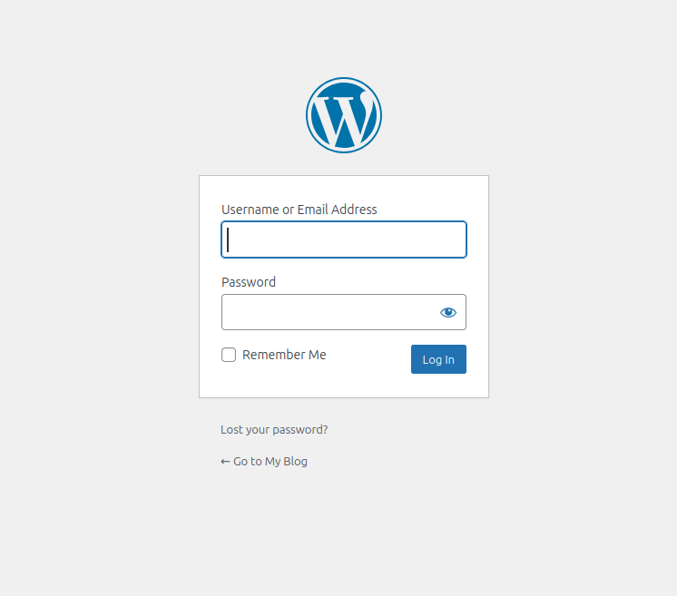

- Bước 2: Truy cập vào phần `Plugins` -> `Add Plugin`.

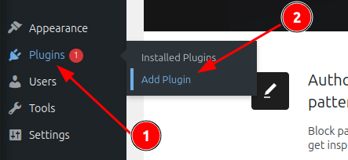

- Bước 3: Upload Plugin `UpdraftPlus` lên.

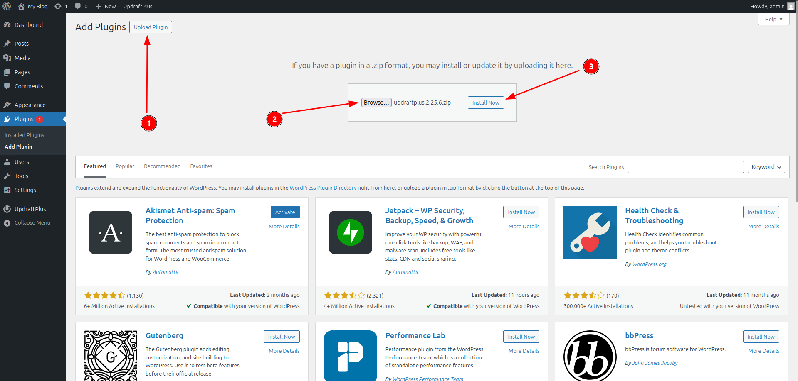

- Bước 4: Chọn `Activate Plugin`.

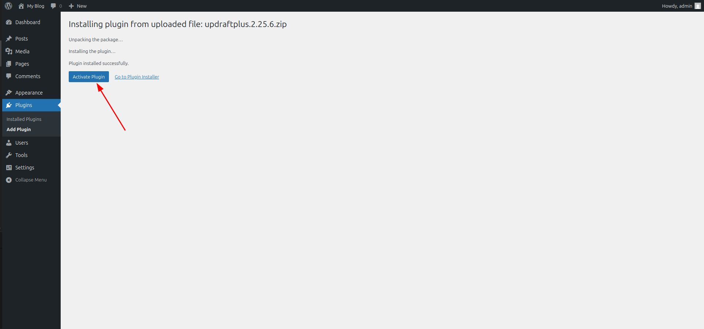

- Bước 5: Truy cập vào Plugin `UpdraftPlus` -> Chọn phần `Backup / Restore` -> Chọn `Backup Now`.

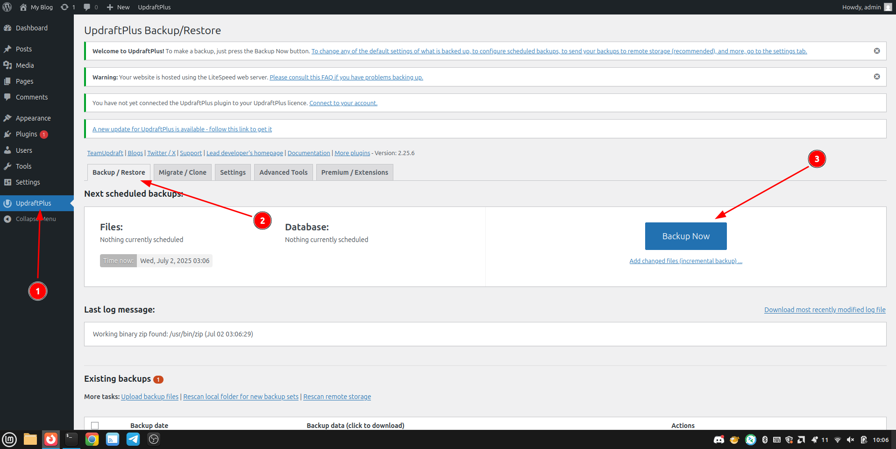

- Bước 6: Chọn vào các checkbox `Include your database in the backup (...)` và `Include your files in the backup (...)` sau đó chọn `Backup Now`.

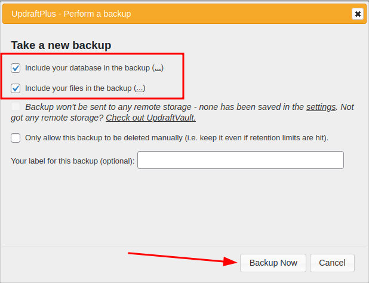

- Bước 7: Đợi đến khi quá trình backup hoàn tất, có thể chọn `Close` để tắt pop-up thông báo đi hoặc đợi tầm 1-2s để thông báo tự tắt.

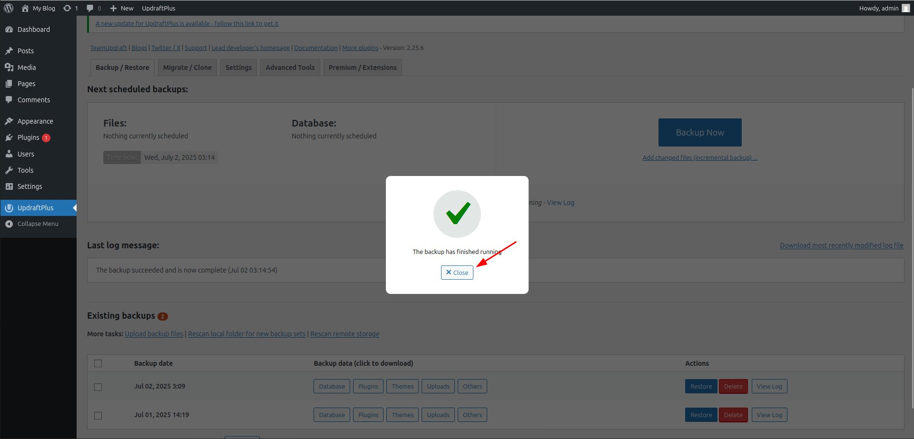

- Bước 8: Sau khi hoàn tất Backup, kiểm tra phần `Existing backups` sẽ thấy bản backup với thời gian cụ thể.

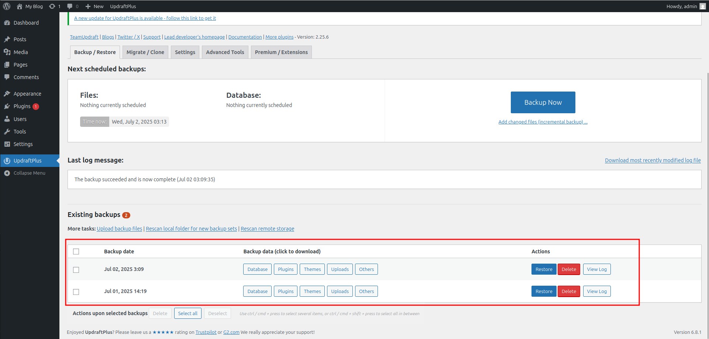

- Bước 9: Tiến hành download các file backup của website về bằng cách chọn vào các phần cần Download (Database, Plugins, Themes, Uploads, Others) trong mục `Backup data (click to download)` sau đó chọn `Download to your computer`.

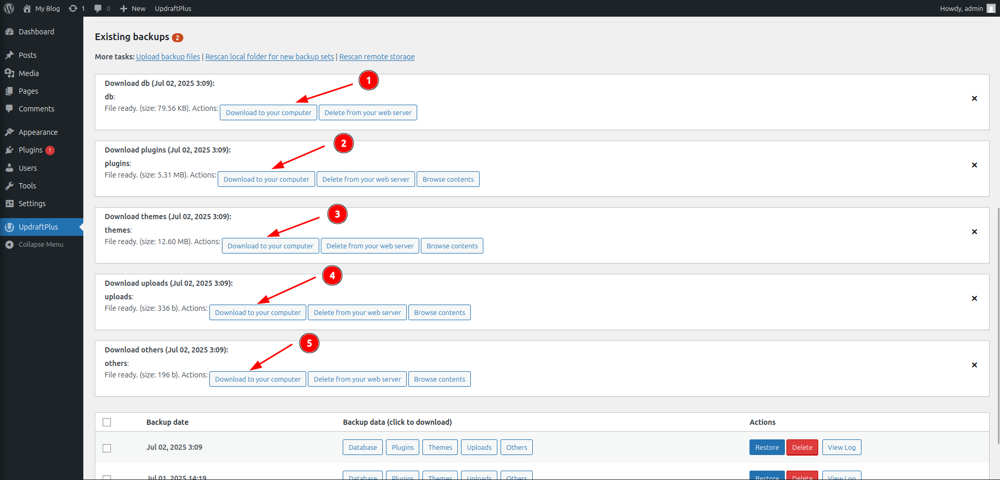

## 2. Import các file backup của website cũ vào website mới.

- Bước 1: Cài đặt WordPress mặc định lên website mới.

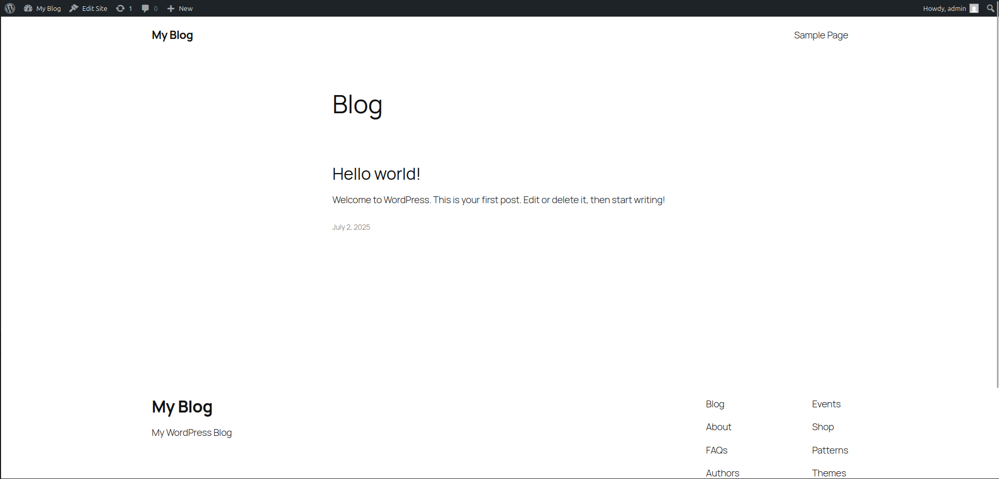

- Bước 2: Thực hiện lại các bước từ 1 -> 4 ở phần `Export` để cài đặt và active Plugin. Sau đó Upload các file vừa download được ở trên vào đường dẫn `domain/wp-content/updraft/`

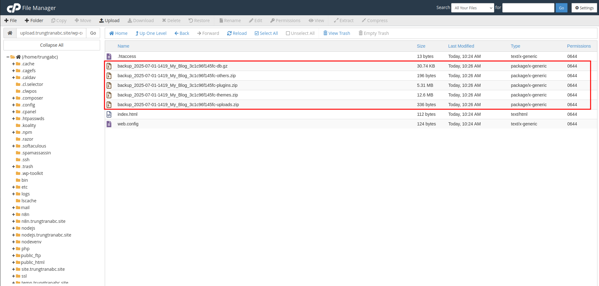

- Bước 3: Truy cập vào Plugin `UpdraftPlus` -> Chọn phần `Backup / Restore` -> Kiểm tra phần `Existing backups`.

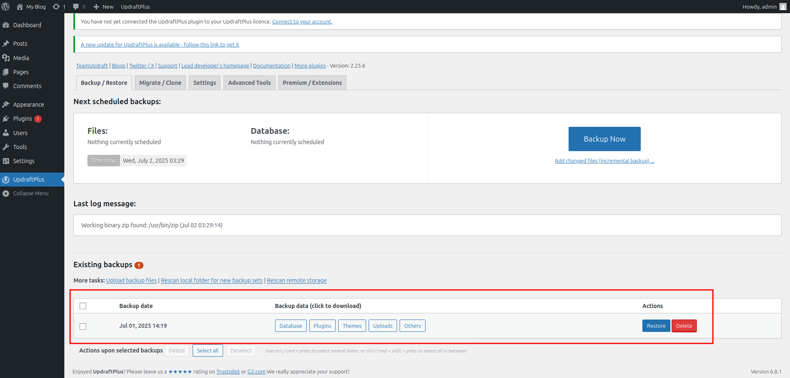

- Bước 4: Kiểm tra nếu đã đầy đủ các thành phần của website WordPress (Database, Plugins, Themes, Uploads, Others) -> Chọn `Restore` để tiến hành restore website.

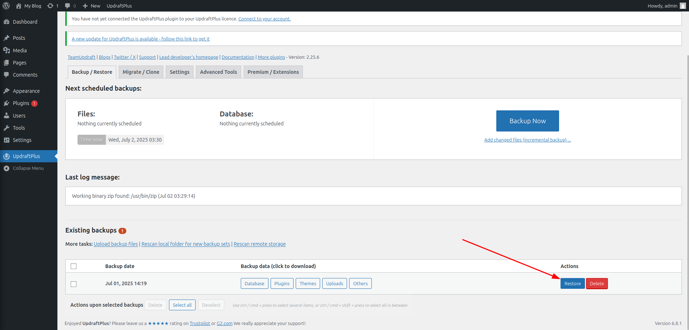

- Bước 5: Tại phần `Choose the components to restore:` chọn các phần cần restore -> Chọn `Next`.

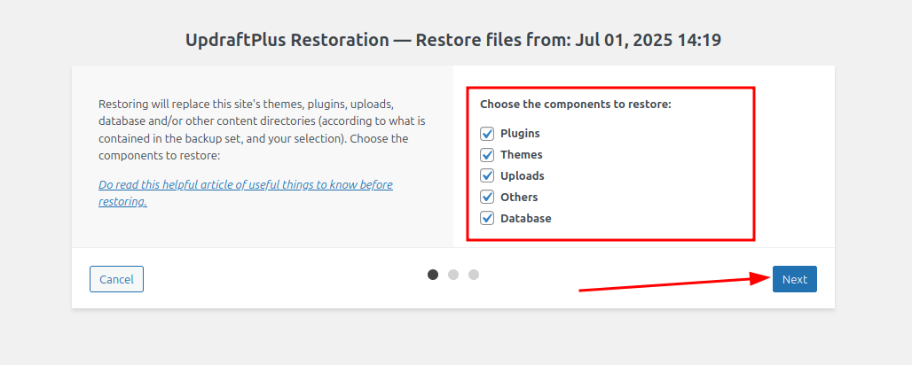

- Bước 6: Ở phần `Retrieving (if necessary) and preparing backup files...` đảm bảo checkbox `Search and replace site location in the database (migrate)` đã được chọn -> Sau đó chọn `Restore`.

.png)

- Bước 7: Đợi quá trình Restore hoàn tất, chọn button `Return to UpdraftPlus configuration`.

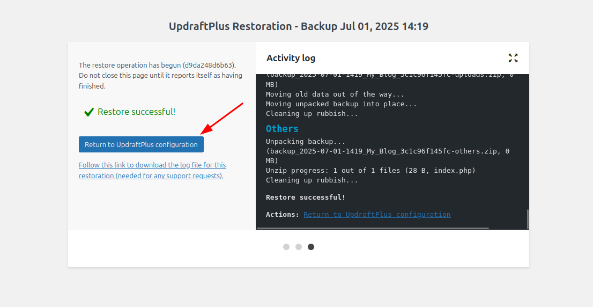

- Bước 8: Đăng nhập lại vào trang wp-admin của website mới bằng thông tin wp-admin của website cũ để kiểm tra.

- Bước 9: Kiểm tra website mới đã chạy ổn định và đúng như website cũ chưa -> done.

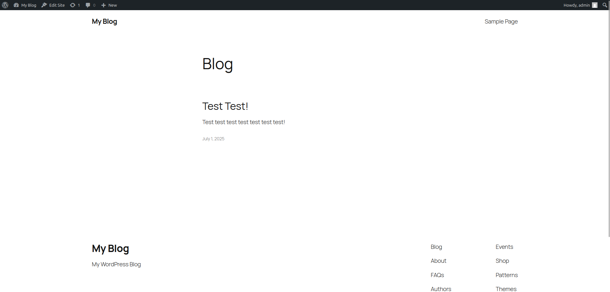

