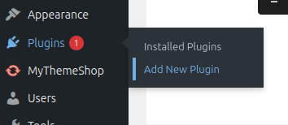
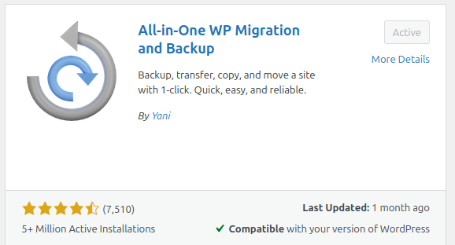
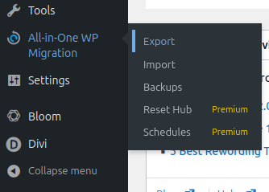
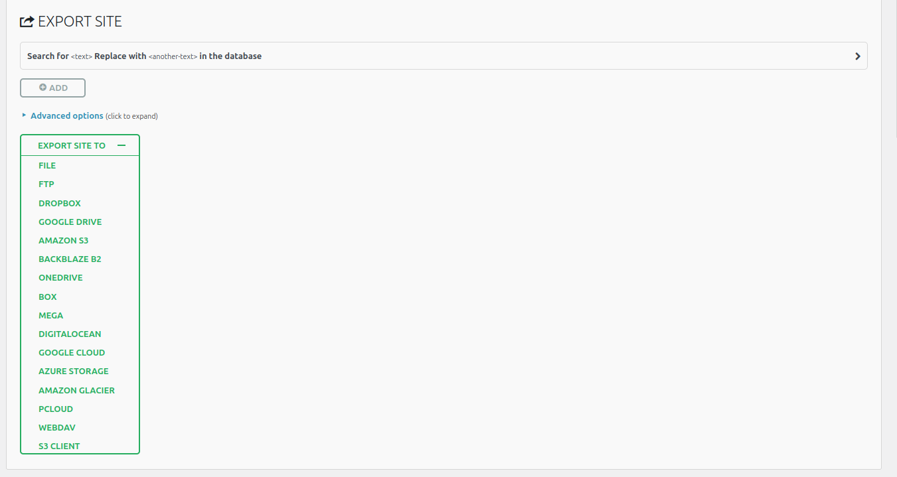
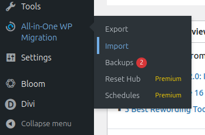
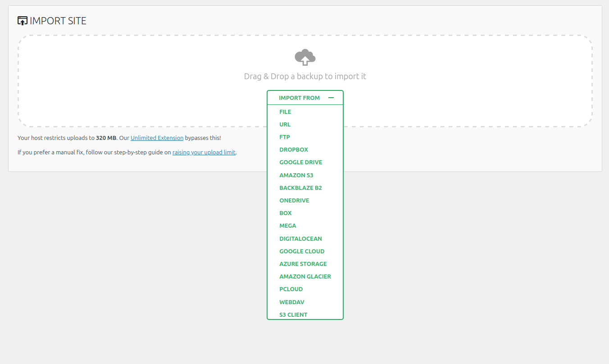

# Plugin All-in-One WP Migration
Đây là plugin giúp người dùng sao lưu, di chuyển và khôi phục website WordPress dễ dàng. Chi tiết từng bước cách sử dụng:
### 1. Cài đặt Plugin
- Vào bảng điều khiển **WordPress** -> **Plugins** -> **Add New**

- Tìm plugin **All-in-One WP Migration** và chọn **Install Now** để cài đặt, sau đó chọn **Activate** để kích hoạt plugin.

### 2. Export (Backup)

- Click chọn vào **All-in-One WP Migration** -> **Export**

- Chọn định dạng xuất (File, Google Drive, Dropbox, ... )

- Nhấn **DOWNLOAD** -> Tải về máy

### 3. Import (Restore)

- Click chọn vào **All-in-One WP Migration** -> **Import**

- Kéo thả hoặc chọn file backup (.wpress) đã tải xuống máy tính

- Đợi quá trình import hoàn tất. Trong quá trình import sẽ có một thông báo rằng việc import sẽ ghi đè lên dữ liệu của website WordPress hiện có. Chỉ cần nhấn **CONTINUE** để tiếp tục

- Cập nhật đường dẫn và cấu trúc permalink nếu cần
