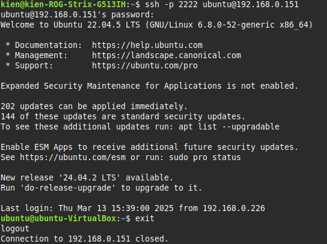

# Linux Command
## 1. ping/hping3

<div align='center'>


</div>

### a. ping và hping3
**ping** là một lệnh dùng để kiểm tra kết nối mạng giữa hai thiết bị. Nó gửi các gói tin ICMP đến địa chỉ đích và đo thời gian phản hồi.

**hping3**
hping3 là một công cụ dòng lệnh mạnh mẽ dùng để kiểm tra, phân tích và tấn công kiểm tra bảo mật mạng. Nó hoạt động tương tự như ping nhưng hỗ trợ TCP, UDP, ICMP, và RAW IP packets, giúp kiểm tra firewall, bảo mật hệ thống và đo hiệu suât mạng.

#### So sánh ping và hping3
|Tiêu chí                    |ping                     |hping3                              |
|----------------------------|-------------------------|------------------------------------|
|chức năng chính             |Kiểm tra kết nối mạng    |Kiểm tra kết nôi mạng nâng cao      |
|Giao thức sử dụng           |ICMP                     |TCP, UDP, ICMP, RAW IP              |
|Hỗ trợ kiểm tra port        |Không                    |Có                                  |
|Mô phỏng tấn công (Pentest) |Không                    |Có (SYN Flood, UDP Flood, DoS test) |
|Tùy chỉnh gói tin           |Không                    |Có (Chỉnh TTL, size, flag TCP)      |
|Quyền yêu cầu               |User thường có thể chạy  |Cần sudo                            |


### b. ttl là gì?
TTL (Time-To-Live) là một trường trong tiêu đề gói tin IP dùng để giới hạn thời gian tồn tại của gói tin trên mạng. Nó giúp ngăn chặn gói tin bị vòng lặp vô hạn trong mạng nếu không đến được đích.

**Cách TTL hoạt động:**
- Khi một gói tin được gửi đi, TTL được hệ điều hành đặt với một giá trị số nguyên (Windows: 128, Linux/macOS: 64, Cisco Router: 255)
- Mỗi khi gói tin đi qua một router, TTL sẽ giảm đi 1.
- Nếu TTL giảm về 0, router sẽ loại bỏ gói tin này.
- Nếu gói tin đến đích trước khi TTL giảm hết, máy đích sẽ trả về phản hồi.

Trong ví dụ trên, phản hồi có **ttl=53**, nghĩa là gói tin đã đi qua 64 - 53 = 11 router trước khi đến đích.
### c. time là gì?
**time** trong lệnh ping là thời gian mà gói tin ICMP cần để đi từ máy gửi đến máy đích và quay lại. Nó còn được gọi là RTT (Round Trip Time).

Trong ví dụ trên, phản hồi có **time=4.98ms**, có nghĩa là gói tin mất 4.98ms để đi đến vietnix.vn và quay lại.

## 2. ssh
SSH (Secure Shell) là một giao thức mạng an toàn giúp kết nối và điều khiển máy tính từ xa thông qua mạng Internet hoặc mạng nội bộ. Nó cho phép thực thi lệnh trên máy chủ từ xa một cách bảo mật bằng cách mã hóa dữ liệu truyền tải. Một số cách sử dụng ssh:
### a. Dùng password
Để kết nối ssh dùng password, ta nhập lệnh sau:

```bash
ssh -p 22 <username>@<Địa chỉ IP>
```

Ví dụ:
```bash
ssh -p 22 kienndt@192.168.1.10
```

Sau đó nhập mật khẩu của user trên máy đích vào để truy cập.

### b. Dùng key
Đây là cách kết nối ssh bảo mật hơn dùng mật khẩu, tránh tấn công brute-force và giúp đăng nhập không cần nhập mật khẩu.

Để kết nối ssh dùng key, trước tiên trên máy client ta cần tạo một cặp khóa bất đối xứng.

Chạy lệnh sau để tạo cặp khóa:
```bash
ssh-keygen -t rsa -b 4096
```

Khi được hỏi nơi lưu khóa, nhấn Enter để lưu vào mặc định: **~/.ssh/**

Khi đã có cặp khóa, bước tiếp theo ta cần làm là copy khóa công khai lên máy chủ nơi client muốn ssh đến. Dùng lệnh sau để thêm khóa vào máy chủ:
```bash
ssh-copy-id <username>@<server_IP>
```

Ví dụ:
```bash
ssh-copy-id kienndt@192.168.1.10
```

Sau khi thêm, khóa công khai của máy client sẽ nằm ở **~/.ssh/authorized_keys**. Sau đó đặt lại đúng quyền cho thư mục **.ssh** và file **authorized_keys** trên máy server.

```bash
chmod 700 ~/.ssh && chmod 600 ~/.ssh/authorized_keys
```

Sau khi thêm khóa và cấp quyền đúng cho các file và thư mục cần thiết trên máy server, kết nối SSH và không cần nhập mật khẩu:

```bash
ssh -p 22 <username>@<Địa chỉ IP>
```

Ví dụ:
```bash
ssh -p 22 kienndt@192.168.1.10
```
### c. Dùng port custom
Để kết nối ssh dùng port custom, trước tiên ta cần chỉnh sửa file **sshd_config**:
```
nano /etc/ssh/sshd_config
```

Uncomment dòng:
```
*#Port 22*
```

Thay 22 bằng port mới, ví dụ **2222**:
```
Port 2222
```
Lưu file và thoát.

Tiếp theo cần mở port trên firewall:
```
ufw allow 2222
```
Khởi động lại ssh để áp dụng thay đổi:
```
systemctl restart ssh
```

Kết nối thử:
```
ssh -p 2222 ubuntu@192.168.0.151
```

<div align='center'>



</div>

## 3. scp
SCP (Secure Copy) là một lệnh trong Linux cho phép sao chép an toàn các tệp và thư mục giữa hai vị trí. Cú pháp lệnh SCP có dạng sau:
```bash
scp [OPTION] <user>@<source_IP>:path/file1 <user>@<destination_IP>:path/file2
```
### a. scp 1 file
Để scp 1 file, ta chạy lệnh sau: 
```bash
scp <user>@<source_IP>:path/file1 <user>@<destination_IP>:path/file2
```

Ví dụ:
```bash
scp ~/abc.txt kienndt@192.168.1.10:~/
```

### b. scp 1 folder
Để scp 1 folder, ta chạy lệnh sau: 
```bash
scp -r <user>@<source_IP>:path/folder1/ <user>@<destination_IP>:path/folder2/
```

Ví dụ:
```bash
scp -r ~/abc/ kienndt@192.168.1.10:~/
```

## 4. rsync
rsync (Remote Sync) là một công cụ mạnh mẽ để sao chép và đồng bộ tệp/thư mục giữa các máy tính hoặc trong cùng một hệ thống. Nó có ưu điểm là chỉ sao chép các phần thay đổi của tệp thay vì toàn bộ tệp, giúp tiết kiệm băng thông và tăng tốc độ đồng bộ. Cú pháp cơ bản:
```bash
rsync [OPTION] source destination
```
### a. rsync 1 file
Để rsync 1 file, ta thực hiện lệnh sau:
```bash
rsync -vz source destination
```
- -v (verbose): Hiển thị quá trình thực hiện.
- -z: Nén dữ liệu khi truyền.
Ví dụ:
```bash
rsync -avz ~/abc.txt kienndt@192.168.1.10:~/
```

### b. rsync 1 folder
Để rsync 1 folder, ta cũng sử dụng lệnh tương tự như rsync 1 file. Tuy nhiên cần thêm tùy chọn **-r** hoặc **-a**
```bash
rsync -avz source destination
```
- -a (archive): Đồng bộ đệ quy toàn bộ thư mục. Giữ nguyên quyền, timestamp, symbolic links.
- -v (verbose): Hiển thị quá trình thực hiện.
- -z: Nén dữ liệu khi truyền.
Ví dụ:
```bash
rsync -avz ~/abc/ kienndt@192.168.1.10:~/abc/
```

## 5. cat
Lệnh cat (viết tắt của "concatenate") trong Linux dùng để hiển thị nội dung file, ghép nhiều file hoặc ghi dữ liệu vào file.
### a. cat nội dung 1 file
```bash
cat file
```

### b. cat dòng thứ <n> trong file
### c. cat nhiều dòng vào 1 file bằng EOF
Để cat nhiều dòng vào 1 file bằng EOF, ta sử dụng lệnh sau:
```bash
cat << EOF > file
line1
line2
line3
EOF
```
Hoặc sử dụng lệnh này để thêm nhiều dòng vào file mà không xóa nội dung cũ:
```bash
cat << EOF >> file
line4
line5
line6
EOF
```

## 6. echo
Lệnh echo trong Linux được dùng để in chuỗi ký tự ra màn hình hoặc ghi nội dung vào file. Đây là một lệnh rất phổ biến trong shell scripting.
### a. Dùng echo để chèn thêm 1 dòng vào cuối file
Để chèn thêm 1 dòng vào cuối file, ta sử dụng lệnh sau:
```bash
echo "new line" >> file
```
### b. Dùng echo để overwirte nội dung của file
Để overwrite nội dung của file, ta sử dụng lệnh sau:
```bash
echo "new data" > file
```


## 7. tail/head
**tail** là một lệnh trong Linux được dùng để hiển thị các dòng cuối cùng của một file hoặc theo dõi nội dung của file theo thời gian thực.

**head** là một lệnh trong Linux được dùng để hiển thị các dòng đầu tiên của một file. Nó giúp nhanh chóng xem nội dung của file mà không cần phải mở toàn bộ file.
### a. tail và tailf
Lệnh tailf trong Linux là một biến thể của tail -f, được dùng để theo dõi nội dung của file theo thời gian thực nhưng có một điểm khác biệt:
- tailf chỉ cập nhật khi file thay đổi, giúp tiết kiệm tài nguyên khi giám sát file trên hệ thống ít hoạt động.
- tail -f liên tục kiểm tra file ngay cả khi không có thay đổi, tốn nhiều tài nguyên hơn.
## 8. sed
Lệnh sed (Stream Editor) trong Linux là một công cụ mạnh mẽ để tìm kiếm, thay thế, chỉnh sửa và xử lý văn bản trong file hoặc trong input stream.
### a. Dùng sed để find and replace một string trong file
Để thay tìm và thay thế một chuỗi trong file, ta sử dụng lệnh:
```bash
sed -i 's/old_text/new_text/' file
```
- -i (in-place): Chỉnh sửa trực tiếp nội dung file.

Nếu không có option -i, sed chỉ hiển thị kết quả mà không thay đổi file.
## 9. traceroute/tracert
**traceroute** trong Linux/macOS hay **tracert** trong Windows là các lệnh giúp kiểm tra đường đi của gói tin từ máy tính đến máy chủ đích trên mạng. Chúng giúp ta biết gói tin đi qua những router nào và mất bao lâu để đến đích, hữu ích để:
- Kiểm tra kết nối mạng.
- Xác định điểm bị chậm hoặc mất gói tin.
- Troubleshoot sự cố mạng.
### a. Giải thích chi tiết kết quả trả về
**Kết quả trả về:**
<div align='center'>


</div>

**Giải thích:**
Đây là đường đi từ máy nguồn đến máy chủ đích có doamin vietnix.vn (103.90.224.90). Mỗi dòng trong kết quả là một hop mà gói tin đi qua.

Mỗi dòng bao gồm:
- Số hop (cột đầu tiên).
- Tên miền hoặc địa chỉ IP trung gian.
- Thời gian phản hồi của router đó (ms).

Nếu có ký tự * nghĩa là router đó không phản hồi.

## 10. netstat
netstat là lệnh dùng để hiển thị thông tin về kết nối mạng, cổng đang mở, bảng định tuyến và thống kê giao thức mạng trên hệ thống.

### a. Hiển thị các socket đang listen
Để hiển thị các socket đang lắng nghe, thực hiện lệnh:
```bash
netstat -tul
```
- -t: Hiển thị TCP
- -u: Hiển thị UDP
- -l: Hiển thị các socket đang lắng nghe

### b. Don't resolve hostname
Để hiển thị thông tin về kết nối mạng mà không phân giải hostname, ta sử dụng lệnh:
```bash
netstat -tuln
```
- -t: Hiển thị TCP
- -u: Hiển thị UDP
- -l: Hiển thị các socket đang lắng nghe
- -n: Không phân giải hostname, chỉ hiển thị địa chỉ IP

Option -n sẽ không phân giải hostname, chỉ hiển thị địa chỉ IP.

### c. Don't resolve portname
Để hiển thị thông tin về kết nối mạng mà không phân giải port, ta sử dụng lệnh:
```bash
netstat -tuln
```
- -t: Hiển thị TCP
- -u: Hiển thị UDP
- -l: Hiển thị các socket đang lắng nghe
- -n: Không phân giải hostname, chỉ hiển thị địa chỉ IP
Option -n sẽ không phân giải portname, chỉ hiển thị số port.

### d. Display process name/PID
Để hiển thị tiến trình đang sử dụng socket, ta sử dụng lệnh:
```bash
netstat -tulnp
```
- -t: Hiển thị TCP
- -u: Hiển thị UDP
- -l: Hiển thị các socket đang lắng nghe
- -n: Không phân giải hostname, chỉ hiển thị địa chỉ IP
- -p: Hiển thị PID và tên tiến trình.

### e. Only show tcp socket
Để hiển thị riêng tcp socket, ta sử dụng lệnh:
```bash
netstat -tlnp
```
- -t: Hiển thị TCP
- -l: Hiển thị các socket đang lắng nghe
- -n: Không phân giải hostname, chỉ hiển thị địa chỉ IP
- -p: Hiển thị PID và tên tiến trình.

### f. Only show udp socket
Để hiển thị riêng udp socket, ta sử dụng lệnh:
```bash
netstat -ulnp
```
- -u: Hiển thị UDP
- -l: Hiển thị các socket đang lắng nghe
- -n: Không phân giải hostname, chỉ hiển thị địa chỉ IP
- -p: Hiển thị PID và tên tiến trình.

## 11. sort
Lệnh sort trong Linux được dùng để sắp xếp nội dung của một file hoặc đầu ra của lệnh khác theo thứ tự tăng dần hoặc giảm dần. Cú pháp cơ bản:
```bash
sort file
```
### a. sort theo thứ tự tăng dần
Để sort theo thứ tự tăng dần, ta sử dụng lệnh:
```bash
sort file
```

### b. sort theo thứ tự giảm dần
Để sort theo thứ tự giảm dần, ta sử dụng lệnh:
```bash
sort -r file
```
- -r: Sắp xếp theo thứ tự giảm dần

### c. sort theo column
Để sort theo cột cụ thể, ta sử dụng lệnh:
```bash
sort -k file
```
- -k: Sắp xếp theo cột cụ thể

Ví dụ, file data.txt:
```bash
Alice 25
Bob 30
Charlie 22
```

Sort theo cột thứ 2:
```bash
sort -k2 data.txt
```

## 12. uniq
Lệnh uniq được dùng để loại bỏ các dòng trùng lặp liên tiếp trong một file hoặc đầu ra của một lệnh khác.
### a. Lọc ra các dòng lặp lại trong một file
Để loại bỏ các dòng lặp lại trong một file, ta sử dụng lệnh:
```bash
uniq file
```

Ví dụ, file data.txt:
```bash
apple
apple
banana
banana
banana
cherry
apple
```
Sau khi chạy lệnh **uniq data.txt**:
```bash
apple
banana
cherry
apple
```

### b. Lọc ra các dòng lặp lại trong file và đếm số lượng các dòng lặp lại
Để lọc ra các dòng lặp lại trong file và đếm số lượng các dòng lặp lại, ta sử dụng lệnh sau:
```bash
sort file | uniq -c
```
- -c: Đếm số lần xuất hiện của mỗi dòng.

Ví dụ, file data.txt có dạng:
```bash
apple
banana
apple
cherry
banana
banana
```
Sau khi chạy lệnh:
```bash
2 apple
3 banana
1 cherry
```

## 13. wc
Lệnh wc (word count) được dùng để đếm số dòng, số từ, số ký tự và số byte trong một file hoặc đầu ra của một lệnh khác.
### a. Đếm số dòng trong file
Để đếm số dòng trong file, ta sử dụng lệnh:
```bash
wc -l file
```
- -l: Đếm số dòng trong file

### b. Đếm số kí tự trong file
Để đếm số ký tự trong file, ta sử dụng lệnh:
```bash
wc -m file
```
- -m: Đếm số ký tự trong file

## 14. chmod, chown, chattr
**chmod** là lệnh dùng để thay đổi quyền của file/folder trong hệ thống Linux.

**chown** là lệnh dùng để thay đổi user và group của file/folder trong hệ thống Linux.

**chattr** là lệnh dùng để đặt thuộc tính đặc biệt cho file, giúp bảo vệ file khỏi bị chỉnh sửa, xóa hoặc thay đổi quyền.
### a. Phân quyền bằng số, phân quyền bằng chữ
Linux sử dụng 3 loại quyền:

|Quyền  |Giá trị số     |Giá trị chữ
--------|---------------|-----------
|read - đọc |4     |r
|write - ghi  |2     |w
|excute - thực thi  |1     |x
#### Phân quyền bằng số:
Để phân quyền bằng số, ta sử dụng lệnh sau:
```bash
chmod 754 file
```
Giải thích:
- 7 (4+2+1): Owner có toàn quyền: đọc, ghi, thực thi.
- 5 (4+0+1): Group có quyền đọc, thực thi.
- 4 (4+0+0): Others có quyền đọc.

#### Phân quyền bằng chữ:
Cú pháp:
```bash
chmod [u/g/o/a] [+/-/=] [r/w/x] file
```
- u(user - chủ sở hữu), g(group - nhóm), o(others - người khác), a (all - tất cả).
- '+' (thêm quyền), '-' (xóa quyền), '=' (thiết lập quyền).

Ví dụ:
```bash
chmod u+x file.sh
```

### b. Đổi owner user/group
#### Đổi owner user:
```bash
chown kienndt file
```

#### Đổi owner group:
```bash
chown :training file
```

#### Đổi cả user & group:
```bash
chown kienndt:training file
```

### c. Set Immutable Attribute
Để set file ở thuộc tính immutable, ta sử dụng lệnh:
```bash
chattr +i file.txt
```

## 15. find
Lệnh find giúp ta tìm kiếm file, thư mục theo tên, kích thước, ngày sửa đổi, quyền truy cập và nhiều tiêu chí khác.
### a. find các file có đuôi .log
Để find các file có đuôi .log, ta sử dụng lệnh:
```bash
find /var/log -name "*.log"
```
### b. find các folder có tên abc
Để find các folder có tên abc, ta sử dụng lệnh:
```bash
find / -type d -name "abc"
```

- -type d: Chỉ tìm thư mục (directory).

### c. find các file có tên abc
Để find các file có tên abc, ta sử dụng lệnh:
```bash
find / -type f -name "abc"
```
- -type f: Chỉ tìm file.

### d. find các file có tên abc và thực hiện phân quyền read only cho file
Để find các file có tên abc và thực hiện phân quyền read only cho file, ta sử dụng lệnh:
```bash
find / -type f -name "abc" -exec chmod 444 {} \;
```
- -exec chmod 444 {} → Thực hiện lệnh chmod 444 trên mỗi file tìm thấy.
- {} → Đại diện cho file tìm thấy (được thay thế bằng đường dẫn thực tế của file).
- \; → Kết thúc lệnh -exec (dấu \ giúp tránh lỗi khi chạy trên Bash).

## 16. cp
Lệnh cp dùng để sao chép file hoặc thư mục trong Linux.
### a. cp file
Để cp file, ta sử dụng lệnh sau:
```bash
cp path/to/sourcefile path/to/destfile
```

### b. cp folder
Để cp folder, ta sử dụng lệnh sau:
```bash
cp -r path/to/sourcedir path/to/destdir
```
- -r: Sao chép thư mục.

## 17. mv
Lệnh mv được dùng để di chuyển hoặc đổi tên file/thư mục.

### a. mv file
Để mv file, ta sử dụng lệnh sau:
```bash
mv path/to/sourcefile path/to/destfile
```
### b. mv folder
Để mv folder, ta sử dụng lệnh sau:
```bash
mv path/to/sourcedir path/to/destdir
```

## 18. cut
Lệnh cut trong Linux được dùng để cắt và trích xuất các phần cụ thể của một dòng văn bản từ file hoặc đầu vào chuẩn. Nó thường được sử dụng để làm việc với dữ liệu dạng cột, tách ra bằng dấu phân cách như tab, dấu phẩy hoặc khoảng trắng.

Cú pháp:
```bash
cut [OPTION] file
```
Một số tùy chọn phổ biến:
- -d (delemiter): Xác định ký tự phân tách.
- -f: Chọn cột theo số thứ tự (dùng với -d).
- -c: Cắt theo vị trí ký tự trong mỗi dòng.
- --complement: Chọn các phần không được chỉ định.

Ví dụ:
Giả sử có file data.csv
```bash
ID,Name,Age
1,John,25
2,Alice,30
3,Bob,22
```
Dùng lệnh cut để lấy cột thứ 2:
```bash
cut -d ',' -f 2 data.csv
```

### a. cut kí tự thứ <n> trong string
Để cut kí tự thứ <n> trong string, ví dụ cắt ký tự thứ 5 trong chuỗi "Hello world" ta sử dụng lệnh:
```bash
echo "Hello world" | cut -c 5
```

### b. cut từ kí tự thứ <n> trở về sau
Để cut kí tự thứ <n> trở về sau trong string, ví dụ cắt ký tự thứ 5 trở về sau trong chuỗi "Hello world" ta sử dụng lệnh:
```bash
echo "Hello world" | cut -c 5-
```

### c. cut từ kí tự thứ <n> trở về trước
Để cut kí tự thứ <n> trở về trước trong string, ví dụ cắt ký tự thứ 5 trở về trước trong chuỗi "Hello world" ta sử dụng lệnh:
```bash
echo "Hello world" | cut -c 1-5
```

## 19. dig
dig (Domain Information Groper) là một công cụ dòng lệnh dùng để truy vấn hệ thống DNS (Domain Name System). Nó giúp lấy thông tin về tên miền, địa chỉ IP, máy chủ DNS và các dữ liệu khác.

Cú pháp cơ bản:
```bash
dig [OPTION] [domain] [Record Type]
```

### a. Dùng Dig command để kiểm tra resolv record A, MX, NS
**Dùng dig để kiểm tra record A:**
```bash
dig kien.vietnix.tech A
```

**Dùng dig để kiểm tra record MX:**
```bash
dig kien.vietnix.tech MX
```
**Dùng dig để kiểm tra record DNS:**
```bash
dig kien.vietnix.tech NS
```

### b. Dùng Dig command để kiểm tra resolv record A, MX, NS với custom DNS
Cú pháp chung:
```
dig @[DNS_SERVER] [DOMAIN] [RECORD_TYPE]
```
**Dùng dig để kiểm tra resolv record A:**

Để dùng dig để kiểm tra resolv record A, ta sử dụng lệnh sau:
```
dig @8.8.8.8 kien.vietnix.tech A
```

**Dùng dig để kiểm tra resolv record MX:**

Để dùng dig để kiểm tra resolv record MX, ta sử dụng lệnh sau:
```
dig @8.8.8.8 kien.vietnix.tech MX
```

**Dùng dig để kiểm tra resolv record NS:**

Để dùng dig để kiểm tra resolv record NS, ta sử dụng lệnh sau:
```
dig @8.8.8.8 kien.vietnix.tech NS
```

## 20. tar/zip/unzip
**tar (Tape Archive)** là một lệnh dùng để nén và giải nén file và thư mục. Nó không tự nén dữ liệu mà chỉ gộp nhiều file lại thành một tệp duy nhất (archive). Tuy nhiên, khi kết hợp với các công cụ nén như gzip hoặc bzip2, nó có thể tạo ra các file nén hiệu quả.

**zip** là một định dạng nén tệp phổ biến và cũng là một lệnh trong hệ điều hành Linux/Unix và Windows dùng để nén và giải nén tệp. Không giống như tar, zip vừa gộp nhiều file vào một file duy nhất vừa nén chúng để giảm kích thước.

### a. Nén/Giải nén file tar.gz
#### Nén file tar.gz
```
tar -czvf file.tar.gz folder/
```
- -c: Tạo file archive.
- -v: Hiển thị danh sách file đang được thêm vào archive.
- -z: Sử dụng gzip để nén.
- -f: Chỉ định tên file archive.
#### Giải nén file tar.gz
```
tar -xzvf file.tar.gz
```
- -x: Giải nén file archive.
- -v: Hiển thị danh sách file đang được thêm vào archive.
- -z: Sử dụng gzip để nén.
- -f: Chỉ định tên file archive.
### b. Nén/Giải nén file .zip
#### Nén file .zip
```
zip file.zip file1.txt file2.txt file3.txt
```

#### Giải nén file .zip
```
unzip file.zip -d my_folder/
```
- -d: Chỉ định vị trí giải nén.


## 21. mount/umount
mount là một lệnh trong Linux dừng để gắn (mount) hệ thống tệp, thiết bị lưu trữ (USB, ổ cứng, đĩa CD/DVD, ...), hoặc các hệ thống file mạng vào một thư mục cụ thể trong hệ thống. Sau khi gắn kết, có thể truy cập dữ liệu từ thiết bị như một phần của hệ thống file.
### a. Add thêm một ổ cứng sdb ~ 5gb
**Đầu tiên, ta cần kiểm tra ổ cứng đã được nhận chưa bằng lệnh:**
```
lsblk
```
Nếu thấy /dev/sdb (~5gb) thì ổ cứng đã được hệ thống nhận diện.

**Sau đó, tạo phân vùng trên ổ /dev/sbd bằng lệnh:**
```
fdisk /dev/sdb
```

Nhập các lệnh sau trong fdisk:
- Nhấn n -> Tạo phân vùng mới
- Nhấn p -> Chọn phân vùng chính
- Nhấn 1 -> Chọn số phân vùng (mặc định là 1)
- Nhấn Enter (để chọn sector bắt đầu mặc định)
- Nhấn Enter (để chọn dung lượng tối đa)
- Nhấn w -> Ghi thay đổi và thoát

**Định dạng phân vùng mới:**
```
mkfs.ext4 /dev/sdb1
```

**Gắn phân vùng vào hệ thống:**
Tạo thư mục để gắn ổ đĩa:
```
mkdir /mnt/data
```

Gắn ổ cứng vào thư mục đó:
```
mount /dev/sdb1 /mnt/data
```

### b. Kiểm tra được có bao nhiêu ổ cứng trên máy chủ
Để kiểm tra có bao nhiêu ổ cứng trên máy chủ, ta sử dụng lệnh:
```
lsblk
```

### c. Mount ổ cứng vào /mnt/test
Để mount ổ cứng vào /mnt/test, ta sử dụng lệnh:
```
mount /dev/sdb2 /mnt/test
```

### d. Umount /mnt/test
Để umount /mnt/test, ta sử dụng lệnh sau:
```
umount /mnt/test
```

## 22. Symbolic links, Hardlinks
### a. Định nghĩa Sym Link
Symbolic link (symlink) là một loại tệp đặc biệt trong Linux, hoạt động như một đường dẫn tham chiếu đến một tệp hoặc thư mục khác.

### b. Định nghĩa Hard Link
Hard link là một cách để tạo một tham chiếu khác đến cùng một tệp trên hệ thống tệp. Không giống như symbolic link (soft link), hard link trỏ trực tiếp đến inode (dữ liệu gốc) của tệp, thay vì chỉ là một đường dẫn.

### c. Ví dụ về Sym Link và Hard Link
#### Ví dụ về Sym link
```
ln -s file1.txt file1_symlink.txt
```

#### Ví dụ về Hard link
```
ln file1.txt file1_hardlink.txt
```

## 23. ls
Lệnh ls trong Linux được dùng để liệt kê danh sách tệp và thư mục trong một thư mục cụ thể. 
### a. Liệt kê danh sách file/thư mục
```
ls
```

### b. Liệt kê danh sách file/thư mục và thuộc tính
```
ls -l
```

### c. Show file ẩn
```
ls -la
```

## 24. ps
Lệnh ps (Process Status) trong Linux được dùng để hiển thị danh sách các tiến trình (process) đang chạy trên hệ thống. Nó giúp bạn kiểm tra trạng thái của tiến trình, tìm PID (Process ID) và giám sát các tiến trình đang chiếm tài nguyên.
### a. show tiến trình
```
ps -ef
```
- -e (every process): Hiển thị tất cả tiến trình trên hệ thống (bao gồm tiến trình không gắn với terminal)
- -f (full format): Hiển thị thông tin chi tiết về tiến trình. 

### b. kill tiến trình
```
kill <PID>
```

## 25. top
Lệnh top trong Linux được dùng để giám sát hệ thống theo thời gian thực, hiển thị danh sách các tiến trình đang chạy cùng với mức sử dụng CPU, RAM, và nhiều thông tin khác. Nó giúp bạn kiểm tra hệ thống và xác định các tiến trình tiêu tốn nhiều tài nguyên.
### a. Kiểm tra tài nguyên cpu đang sử dụng của một vài process đang chạy
```
top -p PID1,PID2,PID3
```


### b. Giải thích về Load average, us, sy, ni, id, wa, hi, si, st, zombie process, sleeping process

- **Load average**: thể hiện mức tải trung bình của CPU; thông số được biểu biến với 3 giá trị lần lượt có ý nghĩa là mức tải trung bình trong 1 phút, 5 phút, 15 phút; hệ số nhỏ hơn số nhân CPU nghĩa là đang tải bình thường, bằng với số nhân CPU có nghĩa CPU đang được chạy hết công suất 100%, lớn hơn số nhân có nghĩa CPU đang bị quá tải.
- **us (User CPU time)**: Phần trăm CPU dành cho tiến trình của user (ứng dụng, chương trình).
- **sy (System CPU time)**: Phần trăm CPU dành cho tiến trình hệ thống (kernel, drivers).
- **ni (Nice CPU time**): Phần trăm CPU dành cho tiến trình có mức ưu tiên thấp.
- **id (Idle CPU time)**: Phần trăm CPU đang rảnh rỗi. Càng cao càng tốt.
- **wa (I/O Wait time)**: CPU đang chờ I/O (đọc/ghi ổ cứng, mạng). Nếu cao, có thể do ổ cứng chậm.
- **hi (Hardware Interrupts)**: Thời gian CPU xử lý ngắt từ phần cứng (bàn phím, chuột, ổ cứng).
- **si (Software Interrupts)**: Thời gian CPU xử lý ngắt từ phần mềm.
- **st (Steal Time)**: CPU bị "ăn cắp" bởi máy ảo. Nếu cao, có thể do tài nguyên CPU bị hạn chế.
- **zombie process**: Process đã kết thúc nhưng vẫn còn tồn tại trong bảng ghi, chưa được hệ thống xóa.
- **sleeping process**: Process đang chờ tài nguyên hoặc sự kiện xảy ra.


## 26. free
Lệnh free trong Linux được sử dụng để kiểm tra bộ nhớ RAM và Swap của hệ thống. Nó hiển thị thông tin về tổng dung lượng, dung lượng đã sử dụng, dung lượng còn trống, và dung lượng được cache/buffer.
### a. Giải thích ram used, free, shared, buff/cache

- **used**: RAM đã được sử dụng, không tính buff/cache.
- **free**: RAM trống, chưa sử dụng.
- **shared**: RAM được chia sẻ giữa các tiến trình.
- **buff/cache**: RAM được hệ thống dùng làm buffer và cache để tăng tốc truy xuất dữ liệu.

## 27. df
### a. Xem dung lượng disk
```
df -h
```

### b. Phân vùng / là gì
Phân vùng / (hay còn gọi là root partition) là phân vùng chính của hệ thống Linux, nơi chứa toàn bộ các tệp và thư mục quan trọng để hệ thống hoạt động.