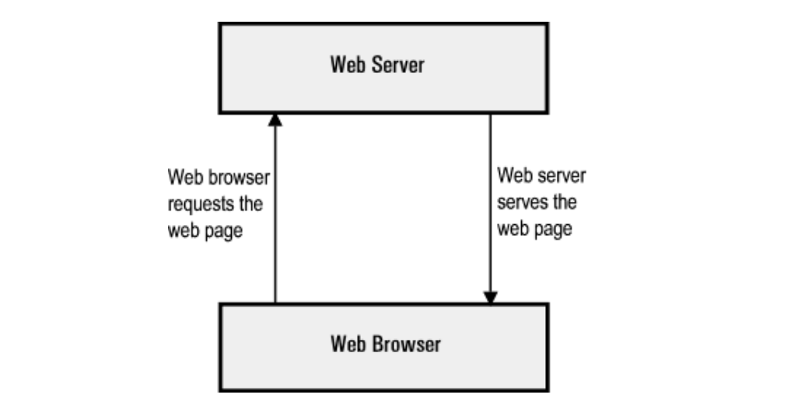
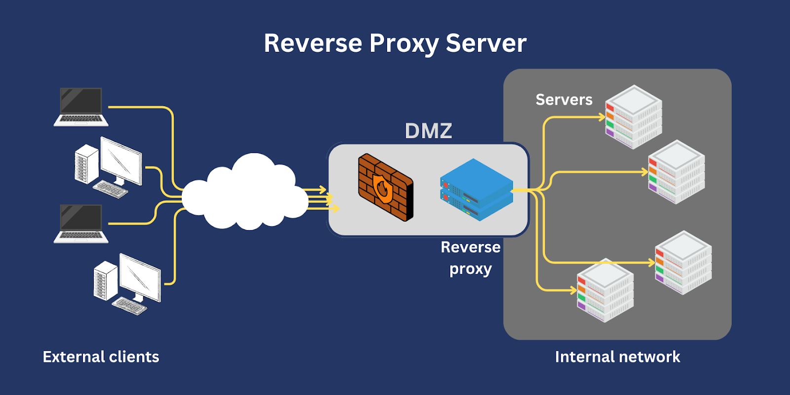
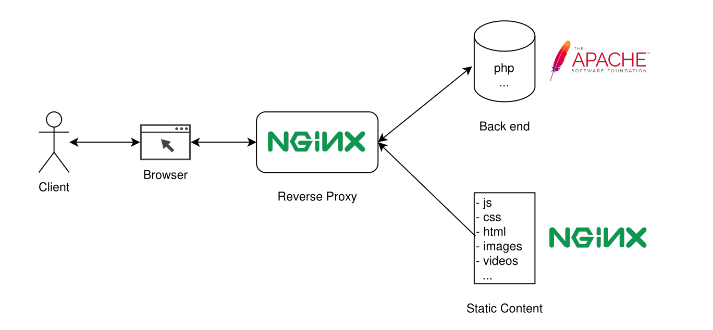
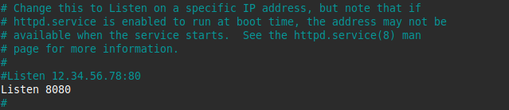

# Reverse Proxy

## 1. Web Server là gì?
**Web Server** là máy chủ cài đặt các chương trình phục vụ các ứng dụng web. Web Server có khả năng tiếp nhận request từ các trình duyệt web và gửi phản hồi đến client thông qua giao thức HTTP hoặc các giao thức khác. Có nhiều web server khác nhau như: Apache, Nginx, IIS, ...

<div align='center'>



</div>

## 1. Nginx là gì?
<div align='center'>


</div>

**Nginx** là 1 máy chủ reverse proxy mã nguồn mở cho các giao thức HTTP, HTTPS, SMTP, POP3 và IMAP, cũng như là 1 máy chủ cân bằng tải (Load Balancer), HTTP cache và web.

Không giống các web server truyền thống, Nginx được biết đến với tính linh hoạt và hiệu suất cao với mức sử dụng tài nguyên thấp. Nginx không dựa trên luồng (thread) để xử lý yêu cầu. Thay vào đó, nó sử dụng 1 kiến trúc bất đồng bộ hướng sự kiện linh hoạt. Kiến trúc này sử dụng ít, nhưng có thể dự đoán được lượng bộ nhớ khi hoạt động.

## 2. Apache là gì?
<div align='center'>


</div>

**Apache** là phần mềm mã nguồn mở phổ biến được sử dụng để phục vụ các trang web trên Internet. Apache HTTP Server chính là tên đầy đủ của hệ thống Apache. Công nghệ đưuọc phát triển và duy trì bởi Apache Software Foundation. Đây là một trong những máy chủ web phổ biến nhất trên thế giới và chạy trên hệ điều hành Unix, Linux, Windows...

Apache cung cấp các tính năng mạnh mẽ cho việc xử lý HTTP requests. Trong đó bao gồm việc hỗ trợ cho nhiều ngôn ngữ lập trình như PHP, Python, Perl và Ruby thông qua các module mở rộng. Công nghệ còn hỗ trợ SSL/TLS để bảo mật giao tiếp web và có khả năng mở rộng linh hoạt nhằm đáp ứng nhu cầu truyền tải lưu lượng truy cập khổng lồ.

## 3. Reverse Proxy là gì?

Reverse Proxy là một máy chủ trung gian thường nằm sau tường lửa trong một mạng riêng. Server này nhận request từ clients rồi chuyển tiếp đến server thích hợp. Các reverse proxy thường được triển khai để giúp tăng cường bảo mật, hiệu suất và độ tin cậy.

<div align='center'>



</div>

### Mô hình Reverse Proxy kết hợp giữa Nginx và Apache
<div align='center'>



</div>

Đây là một mô hình reverse proxy kết hợp giữa Nginx và Apache. Cụ thể hơn, ta sẽ sử dụng Apache để làm web server triển khai trang web ở local host. Sau đó sử dụng tính năng reverse proxy của Nginx để nhận request của clients từ Internet và forward các request này đến Apache để xử lý.

Mục đích sử dụng mô hình này vì đây là sự kết hợp hoàn hảo của Nginx và Apache. Trong khi Nginx có thể tiếp nhận và xử lý các request file tĩnh mà ko cần thông qua php hay là backend server, chỉ forward file động qua backend, từ đó giảm tải cho backend. Thì Apache lại có thể xử lý các request file động một cách tối ưu hơn, đồng thời hỗ trợ mở rộng linh hoạt, đáp ứng tốt nhu cầu xử lý lưu lượng truy cập lớn.

Lợi ích của mô hình:
- Hiệu suất cao hơn:
  
  + Nginx xử lý file tĩnh nhanh hơn Apache.
  + Apache chỉ tập trung xử lý file động, giúp tăng hiệu suất.
- Giảm tải cho backend:
  + Nginx xử lý các request đơn giản, giúp giảm tải áp lực cho Apache.
  + Khi có lưu lượng truy cập lớn, Nginx có thể phân phối hiệu quả.
- Bảo mật tốt hơn: 
  + Nginx đứng trước Apache giúp che giấu backend, từ đó có thể hạn chế được các tấn công DDoS cơ bản.

## 4. Cấu hình


Thư mục chứa source code:

**WordPress:**
```
/var/www/html/wordpress/
```

**Laravel**
```
/var/www/html/laravel/
```

### Cài đặt Apache

```
dnf install -y httpd
```

Khởi động và kích hoạt Apache khởi động cùng hệ thống.

```
systemctl start httpd
systemctl enable httpd
```
Vì sau đó cần cài đặt Nginx để làm Reverse Proxy nên cần chỉnh lại port mặc định của Apache.

```
nano /etc/httpd/conf/httpd.conf
```

Tìm dòng:

```
Listen 80
```

Đổi thành:
```
Listen 8080
```

Lưu và khởi động lại Apache:
```
systemctl restart httpd
```

<div align='center'>



</div>

### Cài đặt Nginx
```
dnf install -y nginx
```

Khởi động và kích hoạt Nginx khởi động cùng hệ thống.

```
systemctl start nginx
systemctl enable nginx
```
### Cấu hình Nginx
#### WordPress:
Tạo file vhost của WordPress cho Nginx. File cấu hình **wordpress.conf** vhost sẽ được lưu trong đường dẫn **/etc/nginx/conf.d/**. Nội dung:

```
server {
    server_name wordpress.kien.vietnix.tech;
    location ~* .(gif|jpg|jpeg|png|ico|wmv|3gp|avi|mpg|mpeg|mp4|flv|mp3|mid|js|css|html|htm|wml)$ {
        root /var/www/html/wordpress;
        expires 30d;
}


    location / {
        proxy_pass http://127.0.0.1:8080;
        proxy_set_header Host $host;
        proxy_set_header X-Real-IP $remote_addr;
        proxy_set_header X-Forwarded-For $proxy_add_x_forwarded_for;
        proxy_set_header X-Forwarded-Proto $scheme;

        add_header Content-Security-Policy "upgrade-insecure-requests"; 
    }
    error_log /var/log/nginx/wordpress.kien.vietnix.tech_error.log;
    access_log /var/log/nginx/wordpress.kien.vietnix.tech_access.log;

    listen 443 ssl; # managed by Certbot
    ssl_certificate /etc/letsencrypt/live/wordpress.kien.vietnix.tech/fullchain.pem; # managed by Certbot
    ssl_certificate_key /etc/letsencrypt/live/wordpress.kien.vietnix.tech/privkey.pem; # managed by Certbot
    include /etc/letsencrypt/options-ssl-nginx.conf; # managed by Certbot
    ssl_dhparam /etc/letsencrypt/ssl-dhparams.pem; # managed by Certbot

}
server {
    if ($host = wordpress.kien.vietnix.tech) {
        return 301 https://$host$request_uri;
    } # managed by Certbot


    listen 80;
    server_name wordpress.kien.vietnix.tech;
    return 404; # managed by Certbot


}
```
Giải thích:
- **server_name**: Domain của trang web.
- **location ~\***: Phần cấu hình để Nginx xử lý các file tĩnh. Khi Nginx nhận request, nó sẽ tìm kiếm các file tĩnh trong thư mục **/var/www/html/wordpress** trước khi chuyển tiếp đến Apache.

- **location /**: Phần cấu hình để Nginx chuyển tiếp các request đến Apache.

  + **proxy_pass**: Chuyển tiếp request từ Nginx đến Apache chạy trên 127.0.0.1:8080
  + **proxy_set_header Host $host**: Gửi tên miền mà người dùng yêu cầu cho Apache.
  + **proxy_set_header X-Real-IP $remote_addr**: Gửi địa chỉ IP thực của client đến Apache.
  + **proxy_set_header X-Forwarded-For $proxy_add_x_forwarded_for**: Thêm hoặc duy trì danh sách các IP mà request đã đi qua. Quan trọng nếu có nhiều lớp proxy hoặc cần logs chính xác.
  + **proxy_set_header X-Forwarded-Proto $scheme**: Gửi giao thức mà client dùng để truy cập cho Apache.
  + **add_header Content-Security-Policy "upgrade-insecure-requests"**: Yêu cầu trình duyệt tự động chuyển HTTP -> HTTPS.
- **error_log**: Chỉ định nơi chứa log nếu có lỗi xảy ra.

- **access_log**: Chỉ định nơi chứa log khi có truy cập đến Server.

- **listen**: Chỉ định Nginx lắng nghe trên port 443.
- Block server còn lại được dùng để cấu hình cho Nginx tự động redirect domain HTTP thành HTTPS và gửi cho Apache.

#### Laravel:
Tạo file vhost của Laravel cho Nginx. File cấu hình **laravel.conf** vhost sẽ được lưu trong đường dẫn **/etc/nginx/conf.d/**. Nội dung:

```
server {
    server_name laravel.kien.vietnix.tech;
    location ~* .(gif|jpg|jpeg|png|ico|wmv|3gp|avi|mpg|mpeg|mp4|flv|mp3|mid|js|css|html|htm|wml)$ {
        root /var/www/html/laravel;
        expires 30d;
}


    location / {
        proxy_pass http://127.0.0.1:8080;
        proxy_set_header Host $host;
        proxy_set_header X-Real-IP $remote_addr;
        proxy_set_header X-Forwarded-For $proxy_add_x_forwarded_for;
        proxy_set_header X-Forwarded-Proto $scheme;

        add_header Content-Security-Policy "upgrade-insecure-requests"; 
    }
    error_log /var/log/nginx/laravel.kien.vietnix.tech_error.log;
    access_log /var/log/nginx/laravel.kien.vietnix.tech_access.log;

    listen 443 ssl; # managed by Certbot
    ssl_certificate /etc/letsencrypt/live/laravel.kien.vietnix.tech/fullchain.pem; # managed by Certbot
    ssl_certificate_key /etc/letsencrypt/live/laravel.kien.vietnix.tech/privkey.pem; # managed by Certbot
    include /etc/letsencrypt/options-ssl-nginx.conf; # managed by Certbot
    ssl_dhparam /etc/letsencrypt/ssl-dhparams.pem; # managed by Certbot

}
server {
    if ($host = laravel.kien.vietnix.tech) {
        return 301 https://$host$request_uri;
    } # managed by Certbot


    listen 80;
    server_name laravel.kien.vietnix.tech;
    return 404; # managed by Certbot


}
```
Giải thích:
- **server_name**: Domain của trang web.
- **location ~\***: Phần cấu hình để Nginx xử lý các file tĩnh. Khi Nginx nhận request, nó sẽ tìm kiếm các file tĩnh trong thư mục **/var/www/html/laravel** trước khi chuyển tiếp đến Apache.

- **location /**: Phần cấu hình để Nginx chuyển tiếp các request đến Apache.

  + **proxy_pass**: Chuyển tiếp request từ Nginx đến Apache chạy trên 127.0.0.1:8080
  + **proxy_set_header Host $host**: Gửi tên miền mà người dùng yêu cầu cho Apache.
  + **proxy_set_header X-Real-IP $remote_addr**: Gửi địa chỉ IP thực của client đến Apache.
  + **proxy_set_header X-Forwarded-For $proxy_add_x_forwarded_for**: Thêm hoặc duy trì danh sách các IP mà request đã đi qua. Quan trọng nếu có nhiều lớp proxy hoặc cần logs chính xác.
  + **proxy_set_header X-Forwarded-Proto $scheme**: Gửi giao thức mà client dùng để truy cập cho Apache.
  + **add_header Content-Security-Policy "upgrade-insecure-requests"**: Yêu cầu trình duyệt tự động chuyển HTTP -> HTTPS.
- **error_log**: Chỉ định nơi chứa log nếu có lỗi xảy ra.

- **access_log**: Chỉ định nơi chứa log khi có truy cập đến Server.

- **listen**: Chỉ định Nginx lắng nghe trên port 443.
- Block server còn lại được dùng để cấu hình cho Nginx tự động redirect domain HTTP thành HTTPS và gửi cho Apache.


#### Default:
Tạo file vhost của Default cho Nginx. File cấu hình **default.conf** vhost sẽ được lưu trong đường dẫn **/etc/nginx/conf.d/**. Nội dung:

```
server {
    listen 80 default_server;
    listen 443 ssl default_server;

    server_name _;

    ssl_certificate /etc/letsencrypt/live/laravel.kien.vietnix.tech/fullchain.pem;
    ssl_certificate_key /etc/letsencrypt/live/laravel.kien.vietnix.tech/privkey.pem;

    root /var/www/html/default;
    index index.html;

    location / {
        try_files $uri $uri/ /index.html;
    }
}
```
Giải thích:
- **listen**: Chỉ định Nginx lắng nghe trên port 80 và 443 cho trang default.
- **server_name _**: Chỉ định Nginx sẽ xử lý các request khi truy cập vào các domain khác đã trỏ tới VPS nhưng chưa được cấu hình hoặc khi truy cập thẳng vào địa chỉ IP về trang default.
- **ssl_certificate**: Chỉ định file .pem của certificate.
- **ssl_certificate_key**: Chỉ định file .pem của key.
- **root**: Chỉ định thư mục chứa nội dung trả về cho trang default.
- **index**: Nội dung trả về của trang default.
- **location /**: Kiểm tra nếu cả $uri và $uri/ đều không tồn tại, Nginx sẽ mặc định trả về file /index.html.

Restart lại Nginx service.
```
systemctl restart nginx
```

### Cấu hình Apache
#### WordPress:
Tạo file vhost của WordPress cho Apache. File cấu hình **wordpress.conf** vhost sẽ được lưu trong đường dẫn **/etc/httpd/conf.d/**. Nội dung:
```
<VirtualHost *:8080>
    ServerAdmin kienndt@vietnix.com.vn
    ServerName wordpress.kien.vietnix.tech
    ServerAlias www.wordpress.kien.vietnix.tech
    DocumentRoot /var/www/html/wordpress
    <Directory /var/www/html/wordpress>
        Options FollowSymlinks
        AllowOverride All
        Require all granted
    </Directory>

    RequestHeader set X-Forwarded-Proto "https"
    RequestHeader set X-Forwarded-Port "443"

    ErrorLog /var/log/httpd/wordpress.kien.vietnix.tech_error.log
    CustomLog /var/log/httpd/wordpress.kien.vietnix.tech_access.log combined
</VirtualHost>
```
Giải thích:
- **ServerAdmin**: Chỉ định Email của quản trị viên
- **ServerName**: Chỉ định domain của trang web
- **ServerAlias**: Chỉ định domain thay thế của trang web.
- **DocumentRoot**: Chỉ định nơi chứa source code để Apache trả về cho người dùng khi có request.
- **Directory**: Đây là block dùng để cấu hình quyền truy cập và điều khiển cho thư mục được chỉ định.
  + **Options FollowSymlinks**: Cho phép liệt kê file nếu không có index.html và cho phép dùng symbolic links.
  + **AllowOverride All**: Cho phép .htaccess ghi đè cấu hình.
  + **Require all granted**: Cho phép tất cả truy cập (Nếu không có dòng này, Apache có thể từ chối request).
- **RequestHeader set X-Forwarded-Proto "https"**: Dùng để chuyển giao thức của request thành HTTPS.
- **RequestHeader set X-Forwarded-Port "443"**: Dùng để chuyển port của request thành 443.
- **ErrorLog**: Chỉ định nơi chứa log nếu xảy ra lỗi.
- **CustomLog**: Chỉ định nơi chứa log khi có truy cập vào trang web.  


#### Laravel:
Tạo file vhost của Laravel cho Apache. File cấu hình **laravel.conf** vhost sẽ được lưu trong đường dẫn **/etc/httpd/conf.d/**. Nội dung:
```
<VirtualHost *:8080>
    ServerAdmin kienndt@vietnix.com.vn
    ServerName laravel.kien.vietnix.tech
    ServerAlias www.laravel.kien.vietnix.tech
    DocumentRoot /var/www/html/laravel/public
    <Directory /var/www/html/laravel/public>
        Options FollowSymlinks
        AllowOverride All
        Require all granted
    </Directory>

    RequestHeader set X-Forwarded-Proto "https"
    RequestHeader set X-Forwarded-Port "443"

    ErrorLog /var/log/httpd/laravel.kien.vietnix.tech_error.log
    CustomLog /var/log/httpd/laravel.kien.vietnix.tech_access.log combined
</VirtualHost>
```
Giải thích:
- **ServerAdmin**: Chỉ định Email của quản trị viên
- **ServerName**: Chỉ định domain của trang web
- **ServerAlias**: Chỉ định domain thay thế của trang web.
- **DocumentRoot**: Chỉ định nơi chứa source code để Apache trả về cho người dùng khi có request.
- **Directory**: Đây là block dùng để cấu hình quyền truy cập và điều khiển cho thư mục được chỉ định.
  + **Options FollowSymlinks**: Cho phép liệt kê file nếu không có index.html và cho phép dùng symbolic links.
  + **AllowOverride All**: Cho phép .htaccess ghi đè cấu hình.
  + **Require all granted**: Cho phép tất cả truy cập (Nếu không có dòng này, Apache có thể từ chối request).
- **RequestHeader set X-Forwarded-Proto "https"**: Dùng để chuyển giao thức của request thành HTTPS.
- **RequestHeader set X-Forwarded-Port "443"**: Dùng để chuyển port của request thành 443.
- **ErrorLog**: Chỉ định nơi chứa log nếu xảy ra lỗi.
- **CustomLog**: Chỉ định nơi chứa log khi có truy cập vào trang web.  

Restart lại Apache service.
```
systemctl restart httpd
```