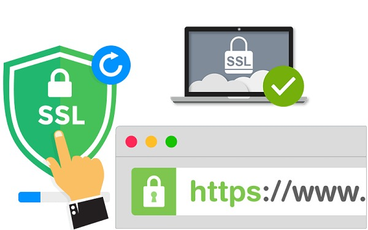

# SSL
<div align='center'>



</div>

## 1. SSL là gì?
SSL là viết tắt của Secure Sockets Layer, một công nghệ tiêu chuẩn cho phép thiết lập kết nối được mã hóa an toàn giữa máy chủ web (host) và trình duyệt web (client).

Kết nối này đảm bảo rằng dữ liệu được truyền giữa host và client được duy trì một cách riêng tư, đáng tin cậy. SSL hiện đã được sử dụng bởi hàng triệu trang web để bảo vệ các giao dịch trực tuyến của họ với khách hàng.

## 2. Có bao nhiêu cách xác thực SSL?
### a. Xác thực tên miền (Domain Validation)
Tất cả các chứng chỉ phải tuân theo quy trình xác thực tên miền được sử dụng để xác nhận quyền sở hữu tên miền.

Các cách xác thực:
#### Xác thực qua email
Bạn sẽ nhận dược một email đến hộ thư quản trị của miền của bạn với một mã xác nhận và liên kết duy nhất. Theo liên kết và nhập mã duy nhất này để vượt qua xác thực.

Địa chỉ IP được phép:
- admin@[your-domain]
- administrator@[your-domain]
- webmaster@[your-domain]
- hostmaster@[your-domain]
- postmaster@[your-domain]

#### Xác thực qua bản ghi DNS
CSR của bạn sẽ được băm, bạn sẽ được cung cấp giá trị băm. Sau đó, nhập bản ghi DNS CNAME của miền của bạn.

Định dạng bản ghi CNAME sẽ như sau:
```
_<CSR MD5 hash value>.<your domain>. CNAME <CSR SHA-256 hash value>.<uniqueValue>.comoda.com.
```

Ghi chú:
- SHA-256 được chia cho dấu “.” (chấm) thành hai nhãn 32 ký tự mỗi nhãn
- Đảm bảo đặt dấu chấm ở cuối tên miền đầy đủ
- Khi đặt mua chứng chỉ đa miền, hãy tạo các bản ghi CNAME riêng cho từng tên miền đầy đủ trong đơn đặt hàng của bạn
- Tên dễ nhớ trong bản ghi CNAME cho miền có “www” mà chứng chỉ được đặt hàng, phải không có “www” (nghĩa là nếu miền của bạn là www.example.com, bản ghi sẽ có dạng như sau: _\<value of MD5 hash of CSR>.example.com.).

Ví dụ:
```
_09f7e02f1290be211da707a266f153b3.subdomain1.yourdomain.com. CNAME 3d874ab7b199418a9753111648448163.9eb1f2608f4da5aa3560154ca1b0df53.comodoca.com. 
```

#### Xác thực qua HTTP(S)
CSR của bạn sẽ được hashed. Bạn sẽ được cung cấp các giá trị băm. Sau đó, tạo một tệp văn bản và lưu nó vào thư mục gốc của trang web của bạn.

Các tập tin và nội dung của nó phải như sau:
- URL tệp:
```
http://<your domain>/.well-known/pki-validation/<Value of MD5 hash in upper case>.txt
```
- Nội dung:
```
<Value of SHA-256 hash>
comodoca.com
```

Ghi chú:
- Quá trình xác thực sẽ không hoàn tất nếu trang web có chuyển hướng
- Kiểm tra xem các thư mục /.well-known/ và /.well-known/pki-validation/ có tồn tại trên máy chủ web hay không
- Nếu bạn yêu cầu chứng chỉ đa miền, thì mỗi miền được bảo vệ trong chứng chỉ phải có một tệp txt trong thư mục gốc của nó
- Đối với các miền có “www”, quá trình xác thực dựa trên các URL không có “www” (nghĩa là nếu bạn yêu cầu chứng chỉ cho miền www.example.com thì tệp phải có thể truy cập được tại http(s)://example.com/. well-known/pki-validation/\<Value of MD5 hash in upper case>.txt)

### b. Xác thực tổ chức (Organization Validation)
**Bước 1: Xác thực tên miền.**

**Bước 2: Xác thực tổ chức.**

Có thể thực hiện như sau:
- Trung tâm chứng nhận kiểm tra xem tổ chức có tồn tại trong cơ quan đăng ký thực thể của tiểu bang hay không.
- Có thể sử dụng sổ đăng ký dữ liệu công khai, chẳng hạn như Dun & Bradstreet, Hoovers, Companies House trên gov.uk và Lursoft.lv
- Địa chỉ có thể được xác nhận bằng một trong các tài liệu sau:
  - Các điều khoản của tổ chức (địa chỉ phải được chỉ định trong đó)
  - Giấy phép của chính phủ cho hoạt động thương mại nơi địa chỉ được chỉ định;
  - Bản sao sao kê tài khoản ngân hàng của công ty trong 6 tháng gần nhất (bạn có thể ghi rõ số tài khoản tại đây);
  - Bản sao hóa đơn điện thoại của công ty trong 6 tháng gần nhất;
  - Bản sao hóa đơn dịch vụ tiện ích (điện, nước, v.v.) của công ty trong 6 tháng gần nhất hoặc hợp đồng thuê nhà hiện có;
- Thư công chứng (Thư ý kiến pháp lý)

**Bước 3: Gọi lại.**

Nhân viên của trung tâm chứng nhận gọi cho bạn để xác nhận tính nguyên bản của yêu cầu chứng chỉ và hoàn tất quy trình xác thực.

Sau khi tất cả các bước được hoàn thành, chứng chỉ sẽ được ký và phát hành.

### c. Xác thực mở rộng (Extended Validation)
**Bước 1: Điền vào các biểu mẫu của trung tâm chứng nhận.**

Trung tâm sẽ gửi cho bạn các mẫu đơn đặc biệt để điền vào.

**Bước 2: Xác nhận tổ chức.**

Quá trình xác nhận tổ chức được mô tả trong OV.

**Bước 3: Xác thực tên miền.**

Quá trình xác thực tên miền được mô tả trong DV

**Bước 4: Gọi lại.**

Nhân viên của trung tâm chứng nhận sẽ gọi để xác nhận tính nguyên gốc của yêu cầu chứng chỉ và hoàn tất quy trình xác nhận.


## 3. CSR file dùng làm gì trong quá trình tạo SSL?
Certificate Signing Request (CSR) file là một file văn bản chứa thông tin của chủ sở hữu tên miền được mã hóa từ máy chủ, được tạo ra trước khi gởi yêu cầu tới nhà cung cấp chứng thực số (Certificate Authority) để tạo ra một chứng thực số SSL.

## 4. PEM file là gì?
Privacy Enhance Mail (PEM) file là một định dạng tệp được sử dụng để lưu trữ và truyền tải các chứng chỉ số, khóa riêng tư, và các dữ liệu bảo mật khác trong các hệ thống mã hóa. Các file PEM thường có phần mở rộng là .pem và được mã hóa bằng Base64, cho phép chúng dễ dàng được trao đổi giữa các hệ thống với nhau.

## 5. Private Key SSL là gì?
Private Key là file mã hóa quan trọng, đóng vai trò bảo mật trong quá trình thiết lập kết nối an toàn giữa mát chủ và trình duyệt.

Cách Private Key hoạt động trong SSL:
- **Tạo cặp khóa**: Khi yêu cầu SSL, hệ thống tạo ra một cặp khóa gồm Private Key và Public Key.
- **Tạo CSR**: Private Key được dùng để tạo Certificate Signing Request (CSR) gửi đến tổ chức cấp chứng chỉ (CA).
- **Cấp chứng chỉ SSL**: CA xác thực và cấp chứng chỉ SSL chứa Public Key.
- **Thiết lập kết nối an toàn**: Khi trình duyệt kết nối đến máy chủ, nó nhận Public Key từ chứng chỉ SSL. Sau đó trình duyệt sử dụng Public Key để mã hóa dữ liệu, chỉ máy chủ (Có Private Key mới có thể giải mã).

## 6. PFX file là gì? Cách chuyển từ file crt sang PFX file.
PFX file là một loại file certificate trong hệ thống Windows. File này chứa cả chứng thực số và khóa riêng tư được mã hóa.

Có thể chuyển đổi file .crt thành file .pfx bằng command **$openssl**. Cụ thể cách thực hiện:
- Chuẩn bị các file: **certificate.crt** (Chứng chỉ SSL), **private.key** (Khóa riêng tư), **ca_bundle.crt** (Chuỗi chứng chỉ CA, nếu có).
- Chạy lệnh OpenSSL:

``` bash
openssl pkcs12 -export -out certificate.pfx -inkey private.key -in certificate.crt -certfile ca_bundle.crt
```


# Domain
<div align='center'>


</div>

## 1. Domain là gì? Các trạng thái của domain?
### a. Domain là gì?

Domain là một địa chỉ duy nhất trên Internet được sử dụng để xác định và truy cập vào một trang web hoặc tài nguyên trực tuyến khác. Nó thường được biểu diễn dưới dạng một chuỗi các ký tự, số và dấu gạch ngang. Domain giúp người dùng dễ dàng ghi nhớ và truy cập vào các trang web một cách thuận tiện, thay vì phải nhớ các địa chỉ IP dài và phức tạp của các máy chủ.

Một domain thường bao gồm 2 phần chính: phần tên miền (domain name) và phần mở rộng (domain extension). Phần tên miền thường là tên duy nhất và phản ánh nội dung hoặc thương hiệu của trang web. Phần mở rộng được thêm vào phần tên miền và thường chỉ định loại domain hoặc quốc gia. Ví dụ: ".com" cho các trang web thương mại, ".org" cho các tổ chức phi lợi nhuận, hoặc ".vn" cho các trang web tại Việt Nam.

### b. Các trạng thái của domain?
#### Các trạng thái tên miền tại đơn vị cấp phát tên miền (Registry)
Một số trạng thái tên miền thường gặp tại đơn vị cấp phát tên miền bao gồm:

- **OK/Active**: OK/Active là trạng thái đang hoạt động bình thường và có thể truy cập được, cũng là trạng thái tên miền phổ biến nhất. Trạng thái này còn cho biết tên miền được đăng ký thành công và tất cả các thông tin cần thiết về tên miền đã được xác thực.
- **addPeriod**: Đây là trạng thái chờ tạm thời sau khi tên miền vừa được đăng ký hoặc gia hạn. Trạng thái AddPeriod thường kéo dài trong khoảng vài ngày. Sau thời gian này, tên miền sẽ chuyển sang trạng thái Active và bạn sẽ không thể yêu cầu xóa tên miền nữa.
- **autoRenewPeriod**: autoRenewPeriod là trạng thái tự động gia hạn tên miền. Nhà đăng ký sẽ tự động gia hạn tên miền của bạn khi nó hết hạn.
- **Inactive**: Trạng thái tên miền domain status đã được đăng ký nhưng đang chờ xác minh thông tin đăng ký, do NameServer chưa liên kết với tên miền. Nếu tên miền của bạn duy trì ở trạng thái này quá lâu, hãy liên hệ ngay với nhà đăng ký để được xử lý.
- **PendingCreate**: Trạng thái tên miền domain status đang chờ xác nhận đăng ký. Đây là trạng thái bạn yêu cầu tạo tên miền và nhà đăng ký đang trong giai đoạn xử lý, phê duyệt yêu cầu của bạn. 
- **PendingDelete**: PendingDelete là trạng thái tên miền hết hạn đăng ký và đang chờ xóa khỏi hệ thống. Sau khi xóa, tên miền sẽ trở về trạng thái tự do và có thể được đăng ký bởi bất kỳ ai.
- **PendingRenew**: Đây là trạng thái tên miền domain status đang chờ gia hạn. Nếu trong thời gian này mà bạn không thực hiện yêu cầu gia hạn nào, tên miền sẽ hết hạn và bị xóa mất.
- **PendingRestore**: Trạng thái tên miền hết hạn và đang trong quá trình chờ khôi phục tên miền. Nếu bạn không thực hiện bất kỳ yêu cầu khôi phục nào trong một khoảng thời gian này, tên miền sẽ chuyển về trạng thái “redemptionPeriod”. Lúc này hãy liên hệ với đơn vị cấp phát tên miền để yêu cầu được xử lý.
- **PendingTransfer**: Trạng thái tên miền domain status đang chờ xử lý yêu cầu chuyển đổi nhà đăng ký. Nếu bạn không muốn chuyển đổi tên miền của mình, bạn nên liên hệ với nhà đăng ký hiện tại ngay lập tức để yêu cầu họ hủy yêu cầu chuyển đổi. Sau đó, tên miền của bạn sẽ được chuyển về trạng thái clientTransferProhibited.
- **PendingUpdate**: PendingUpdate là trạng thái tên miền đang được cập nhật thông tin. Tên miền sẽ ở trạng thái này cho đến khi hệ thống xử lý những thay đổi và cập nhật thông tin tên miền. Tuy nhiên, nếu bạn không có nhu cầu thay đổi thông tin nào liên quan đến tên miền, bạn cần liên hệ với nhà đăng ký để giải quyết vấn đề. Trạng thái pendingUpdate sẽ bị gỡ bỏ sau đó.
- **RedemptionPeriod**: Đây là trạng thái tên miền đã hết hạn và đang trong thời gian chuộc lại. Chủ sở hữu tên miền có thể trả phí chuộc để khôi phục tên miền. Phí chuộc thường sẽ cao hơn phí gia hạn. Nếu chủ sở hữu tên miền không chuộc lại tên miền trong thời gian quy định, tên miền sẽ bị xóa khỏi hệ thống và có thể được mua lại bởi bất kỳ ai.
- **RenewPeriod**: Trạng thái tên miền domain status đã được gia hạn. Trạng thái này thường được đặt trong một khoảng thời gian giới hạn để chủ sở hữu tên miền xác nhận gia hạn. Nếu muốn biết về cách gia hạn tên miền, bạn có thể liên hệ với nhà đăng ký để tìm hiểu thêm thông tin.
- **ServerDeleteProhibited**: Trạng thái khóa tên miền để nó không bị xóa. Trạng thái tên miền này thường được kích hoạt trong các trường hợp tranh chấp pháp lý, theo yêu cầu của chủ sở hữu tên miền, hoặc khi tên miền đang trong trạng thái redemptionPeriod.
- **ServerHold**: Trạng thái tên miền đang bị tạm ngưng hoạt động bởi cơ quan quản lý tên miền (registry). Tên miền bị đặt ở trạng thái ServerHold khi vi phạm các quy định, chính sách của registry hoặc đang tranh chấp pháp lý.
- **ServerRenewProhibited**: ServerRenewProhibited là trạng thái tên miền domain status không thể được gia hạn đăng ký. Trạng thái này thường gặp trong các trường hợp tranh chấp pháp lý. Khi tên miền ở trạng thái ServerRenewProhibited, chủ sở hữu tên miền sẽ không thể gia hạn tên miền khi nó hết hạn.
- **ServerTransferProhibited**: ServerTransferProhibited là trạng thái không được chuyển đổi tên miền từ nhà đăng ký tên miền này sang một nhà đăng ký tên miền khác. Trạng thái này thường được áp dụng trong các trường hợp tranh chấp pháp lý hoặc khi người sở hữu tên miền yêu cầu. Để gỡ bỏ trạng thái này, bạn cần liên hệ với nhà đăng ký tên miền để được hỗ trợ giải quyết.
- **ServerUpdateProhibited**: Đây là trạng thái tên miền không được phép cập nhật. Trạng thái tên miền này không phổ biến, thường được đặt theo yêu cầu của chủ sở hữu tên miền. Nếu bạn muốn cập nhật lại tên miền, bạn cần liên hệ với nhà đăng ký để yêu cầu họ gỡ bỏ trạng thái này.
- **TransferPeriod**: Trạng thái TransferPeriod là trạng thái tên miền đang được chuyển từ một nhà đăng ký sang một nhà đăng ký khác. Trong trạng thái này, tên miền vẫn hoạt động bình thường và có thể truy cập được. Tuy nhiên, nhà đăng ký mới chưa có quyền kiểm soát hoàn toàn đối với tên miền. Nếu không muốn chuyển tên miền của mình, bạn nên liên hệ với nhà đăng ký hiện tại để yêu cầu họ từ chối yêu cầu chuyển.
#### Các trạng thái tên miền tại nhà đăng ký tên miền (Registrar)
Một số trạng thái tên miền thường gặp tại nhà đăng ký tên miền bao gồm:
- **ClientUpdateProhibited**: Đây là trạng thái cấm cập nhật tên miền. Trạng thái này được đặt bởi nhà đăng ký tên miền để ngăn chặn việc cập nhật tên miền trái phép. Do đó, khi tên miền ở trạng thái ClientUpdateProhibited, bạn sẽ không thể thực hiện các thay đổi đối với tên miền. Để cập nhật thông tin tên miền, bạn phải liên hệ với nhà đăng ký để được hướng dẫn.
- **ClientTransferProhibited**: ClientTransferProhibited là trạng thái khóa chuyển nhượng tên miền. Trạng thái này được đặt bởi nhà đăng ký tên miền để ngăn chặn việc chuyển nhượng tên miền trái phép. Do đó, bạn sẽ không thể chuyển nhượng tên miền của mình sang nhà đăng ký tên miền khác khi tên miền ở trong trạng thái này. Trạng thái này thường chỉ xuất hiện khi tên miền của bạn đang có tranh chấp hoặc có yêu cầu pháp lý.
- **ClientRenewProhibited**: ClientRenewProhibited là trạng thái không cho phép gia hạn đăng ký cho tên miền. Trạng thái này được đặt khi tên miền có dấu hiệu bị chiếm quyền điều khiển hoặc đang trong trạng thái redemptionPeriod. Đây là một trạng thái hiếm khi xảy ra bởi vì nó chỉ xuất hiện khi có tranh chấp pháp lý.
- **ClientHold**: ClientHold là trạng thái tạm ngừng hoạt động của tên miền. Tên miền ở trạng thái này sẽ không thể truy cập vào được và các dịch vụ liên quan đến tên miền cũng sẽ tạm dừng hoạt động. Trạng thái này được kích hoạt khi tên miền của bạn chưa hoàn thành hồ sơ đăng ký, đang bị tranh chấp pháp lý hoặc để kiểm tra nếu tên miền của bạn bị nghi ngờ giả mạo hoặc được sử dụng cho mục đích gian lận.
- **ClientDeleteProhibited**: clientDeleteProhibited là trạng thái ngăn không cho tên miền bị xóa. Trạng thái này chỉ xuất hiện khi có tranh chấp về tên miền, do bạn yêu cầu hoặc khi tên miền đang trong trạng thái redemptionPeriod.


## 2. Subdomain là gì?
Subdomain là một phần cấu thành của tên miền chính. Nó giống như một nhánh nhỏ trên cây lớn là tên miền gốc.

Subdomain được tạo ra nhằm mục đích chia nhỏ tên miền chính thành các khu vực nhỏ hơn, dễ quản lý và nhận biết hơn. Thông thường, mỗi subdomain sẽ đại diện cho một nội dung cụ thể trên website. Vì vậy, với vai trò là tên miền phụ, subdomain sẽ giúp chia nhỏ và cấu trúc lại website một cách khoa học, từ đó tối ưu trải nghiệm người dùng cũng như hiệu quả SEO.
### Cấu trúc của Subdomain
Subdomain có cấu trúc tương tự như tên miền chính, bao gồm tên subdomain + tên miền gốc. Cụ thể, cấu trúc của một subdomain thường có dạng:

**[subdomain].[tên miền gốc]**

Trong đó:
- **subdomain:** Được đặt trước tên miền gốc, thường ngăn cách bằng dấu chấm. Đây là phần xác định mục đích hay nội dung cụ thể của subdomain.
- **tên miền gốc:** Là tên miền chính của website, được đăng ký và sở hữu bởi chủ site.

## 3. Virtual Hosts là gì?
Virtual Hosts là một tính năng trong web server và cũng là một phương thức lưu trữ, cho phép nhiều trang web hoặc tên miền hoạt động trên cùng một máy chủ vật lý hoặc một địa chỉ IP duy nhất. Đây là giải pháp hữu ích giúp tối ưu hóa tài nguyên máy chủ, giảm chi phí vận hành và đơn giản hóa việc quản lý hosting cho nhiều website.

# Mail Server
<div align='center'>


</div>

## 1. Tìm hiểu MX Record.
MX Record (Mail Exchange Record) là bản ghi DNS xác định máy chủ xử lý email cho tên miền. Nó giúp chuyển hướng email đến đúng máy chủ nhận, đảm bảo rằng email được gửi đến địa chỉ chính xác.

MX Record cũng có thể chỉ định và sắp xếp thứ tự ưu tiên cho nhiều máy chủ email, điều này rất quan trọng để cân bằng tải và tránh bị gián đoạn dịch vụ. Đồng thời, MX Record cũng đóng vai trò quan trọng trong việc khắc phục sự cố khi email không được gửi đúng cách.

## 2. Tìm hiểu DKIM, SPF, PTR.
### a. DKIM
Domain Keys Identified Mail (DKIM) là một phương thức giúp xác nhận các email thông qua chữ ký số của miền gửi thư, việc này giúp tránh email giả mạo, mục đích chính ban đầu của DKIM được thiết kế ra là để người nhận có thể xác định email đến từ tên miền cụ tể nào, tên miền đó có thật không, có được ủy quyền hay không.

Bên cạnh đó, DKIM cũng có khả năng chặn các địa chỉ email giả mạo, chức năng hữu ích được sử dụng rất nhiều ngày nay, nhất là đối với các dòng thư giả mạo, thư lừa đảo, email spam chứa mã độc, ...

Khóa công khai thường được công bố trên DNS dưới dạng một TXT record. Khi gửi email, bộ ký thư sẽ chèn lên đầu thư một trường DKIM-Signature có nội dung đặc biệt.

### b. SPF
Sender Policy Framework (SPF) là một công nghệ xác thực email, giúp kiểm tra tính hợp pháp của email. Nó hoạt động bằng cách cho phép chủ sở hữu tên miền xác định danh sách các máy chủ email được phép gửi email thay mặt cho tên miền đó. Khi nhận được email, máy chủ email sẽ kiểm tra bản ghi SPF của tên miền được chỉ định trong địa chỉ email của người gửi. Nếu email không được gửi từ máy chủ được ủy quyền, nó có thể bị từ chối hoặc đánh dấu là spam.

### c. PTR
Pointer (PTR) Record là một loại bản ghi DNS được sử dụng để  thực hiện tra cứu ngược (Reverse DNS Lookup). Nó ánh xạ một địa chỉ IP đến một tên miền, trái ngược với bản ghi A hoặc AAAA, vốn ánh xạ tên miền đến địa chỉ IP.

# DNS
<div align='center'>


</div>

## 1. DNS là gì?
DNS, viết tắt của Domain Name System, được hiểu là hệ thống phân giải tên miền. Nghĩa là, đây là một hệ thống chuyển đổi các tên miền website, chuyển từ dạng www.example.com sang dạng địa chỉ IP tương ứng với tên miền và ngược lại.
## 2. Các loại record DNS?
Các loại record DNS phổ biến bao gồm:
- **SOA (Start Of Authority) Record**: Cung cấp thông tin về quản trị DNS của tên miền, như email quản trị viên và thông số cập nhật. Bao gồm các thông tin về domain trên DNS Server, thông tin về zone transfer.
- **NS (Name Server) Record**: Chỉ định máy chủ DNS chịu trách nhiệm cho một tên miền.
- **A Record**: Trỏ một tên miền hoặc subdomain đến một địa chỉ IPv4.
- **AAAA Record**: Giống với A Record nhưng trỏ đến địa chỉ IPv6.
- **PTR (Pointer) Record**: Dùng để tra cứu ngược (Reverse DNS), ánh xạ từ địa chỉ IP đến tên miền.
- **SRV (Service) Record**: Xác định vị trí dịch vụ cụ thể trong một domain, ví dụ tên máy chủ và số cổng của các máy chủ cho các dịch vụ được chỉ định.
- **CNAME (Canonical Name) Record**: Trỏ một tên miền hoặc subdomain đến một tên miền khác.
- **MX (Mail Exchange) Record**: Xác định máy chủ email của tên miền.
- **TXT (Text) Record**: Lưu trữ thông tin dạng văn bản, thường được dùng để xác thực máy chủ với tên miền.
- **DKIM (Domain Key Identified Mail) Record**: Là bản ghi dùng để xác thực người gửi bằng cách mã hóa một phần email gửi bằng một chuỗi ký tự, xem như là chữ ký. Khi email được gửi đi máy chủ mail sẽ kiểm so sánh với thông tin bản ghi đã được cấu hình trong DNS để xác nhận.
- **SPF (Sender Policy Framework) Record**: Là một dạng thông tin được lưu trữ trong DNS của một tên miền. Nó cho phép một tên miền xác định danh sách các máy chủ email được phép gửi email thay cho tên miền đó.

## 3. Nguyên tắc làm việc của DNS?
Mỗi nhà cung cấp dịch vụ (ISP) vận hành và duy trì DNS server riêng của mình. Tức là nếu một trình duyệt tìm kiếm địa chỉ của một website thì DNS server phân giải tên website này phải là DNS server của ISP đó chứ không phải là của một ISP nào khác.

INTERNIC (Internet Network Information Center) chịu trách nhiệm theo dõi các tên miền và các DNS server tương ứng. INTERNIC là một tổ chức được thành lập bởi NSF (National Science Foundation), AT&T và Network Solution, chịu trách nhiệm đăng ký các tên miền của Internet. INTERNIC chỉ có nhiệm vụ quản lý tất cả các DNS server trên Internet chứ không có nhiệm vụ phân giải tên miền cho từng địa chỉ.

Một DNS server có thể truy vấn các DNS server khác để tìm kiếm thông tin nếu nó chưa có câu trả lời. Mỗi DNS server thường có hai vai trò chính:
- Phân giải tên miền: Tìm địa chỉ IP tương ứng với tên miền trong phạm vi của nó.
- Trả lời truy vấn từ bên ngoài: Nếu một DNS server nhận được yêu cầu từ bên ngoài, nó sẽ cố gắng phân giải tên miền mà nó quản lý.

Khi một DNS server tra cứu tên miền, nó có thể ghi nhớ (cache) kết quả lại để dùng cho những truy vấn sau. Việc này giúp tăng tốc độ truy vấn và giảm tải hệ thống, nhưng khả năng lưu trữ tùy thuộc vào cấu hình của từng DNS.

## 4. Cách phân giải địa chỉ DNS?
Có 2 cách phân giải địa chỉ DNS cơ bản:
### a. Phân giải đệ quy (Recursive Resolution): 
Khi máy khách (client) gửi yêu cầu phân giải tên miền, máy chủ DNS Resolver (thường là ISP) sẽ tự động truy vấn các máy chủ DNS khác cho đến khi nhận được địa chỉ IP chính xác. Ví dụ:
- Client nhập www.example.com vào trình duyệt.
- DNS Resolver hỏi **Root DNS Server -> TLD DNS Server -> Authoritative DNS Server.**
- Khi tìm thấy IP, kết quả sẽ được trả về theo thứ tự **Authoritative DNS Server -> TLD DNS Server -> Root DNS Server -> DNS Resolver**. Sau đó DNS Resolver trả kết quả cho client.
### b. Phân giải lặp (Iterative Resolution): 
Máy khách (client) sẽ trực tiếp truy vấn từng DNS server theo thứ tự, thay vì dựa vào DNS Resolver. Mỗi DNS server sẽ chỉ trả lời với thông tin về máy chủ tiếp theo cần truy vấn, cho đến khi tìm thấy được địa chỉ IP. Ví dụ:
- Client gửi yêu cầu đến **DNS Resolver**.
- DNS Resolver hỏi **Root DNS Server** -> nhận được địa chỉ của **TLD DNS Server**.
- DNS Resolver hỏi **TLD DNS Server** -> nhận được địa chỉ của **Authoritative DNS Server**.
- DNS Resolver hỏi **Authoritative DNS Server** -> nhận được địa chỉ IP và gửi lại cho client.

<div align='center'>


</div>