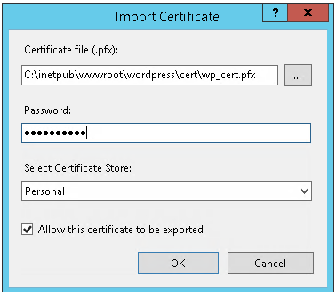

# Windows Server

## 1. Thực hiện allow port, allow ip trên window fw

## 2. Thực hiện block port, block ip trên window fw

## 3. Thực hiện giới hạn port, giới hạn ip trên window fw chỉ cho phép ip chỉ định truy cập

## 4. Cài đặt Webserver IIS

### Cài đặt Webserver IIS
Nhấn vào **Add roles and features**

Ở mục **Installation Type** chọn **Role-based or feature-based installation** sau đó chọn **Next**

Tiếp tục **Next** đến mục **Server Roles**, chọn các **Web Server (IIS)** với các option như sau:

Những mục sau chọn mặc định cho tất cả, sau đó nhấn **Install**.

Kiểm tra trong **Tools** nếu thấy **Internet Information Services (IIS) Manager** là cài đặt thành công.

### Cài đặt Website WordPress

Để cài đạt WordPress, ta cần cài cài đặt PHP7.4, MySQL 5.7.44, và source code của WordPress.

#### PHP7.4:

**PHP (Hypertext Preprocessor)** là một ngôn ngữ lập trình mã nguồn mở, được sử dụng phổ biến để phát triển web động. PHP chủ yếu chạy trên server-side (phía máy chủ) và có thể nhúng trực tiếp vào mã HTML.

**Link Download**: [Download](https://windows.php.net/downloads/releases/)

#### MySQL:

**MySQL** là một hệ quản trị cơ sở dữ liệu quan hệ (RDBMS - Relational Database Management System) mã nguồn mở, được sử dụng rộng rãi để lưu trữ, quản lý và truy vấn dữ liệu.

**Link Download**: [Download](https://dev.mysql.com/downloads/installer/)

#### WordPress:

**WordPress** là một hệ thống mã nguồn mở dùng để xuất bản blog/website được viết bằng ngôn ngữ lập trình PHP và cơ sở dữ liệu MySQL. WordPress được biết đến như một CMS miễn phí nhưng tốt, dễ sử dụng và phổ biến nhất trên thế giới.

**Link Download**: [Download](https://vi.wordpress.org/download/)

### Cài đặt SSL
Vào **Internet Information Services(IIS) Management** chọn vào **http://localhost/** ở bên trái như sau:

Sau đó chọn **Server Certificates**. Tiếp theo chọn **Create Certificate Request...** ở bên phải. Điền các thông tin cần thiết sau đó bấm **Next**.

Chọn thuật toán **RSA** và bit length là **2048** sau đó bấm **Next**.

Chọn nơi lưu trữ cho file sau đó bấm finish. Tuy nhiên, file tạo ra là file **.txt**, ta cần chuyển lại định dạng thành **.csr**

Sau đó tạo ssl miễn phí bằng trang web cấp SSL miễn phí như **ZeroSSL**. Sau khi quá trình tạo ssl hoàn tất, ZeroSSL sẽ trả về file **.crt** và file **key**. Dùng các file này để tạo thành file **.pfx**.

Sau khi có file **.pfx** vào **Server Certificates** trong **IIS Management** vào chọn **Import...** và điền các thông tin cần thiết vào để hoàn tất quá trình tạo SSL cho domain.

## 5. Cài đặt SQL Server 2012

**SQL Server (hay Microsoft SQL Server)** là một hệ thống quản lý cơ sở dữ liệu quan hệ (RDBMS) được phát triển bởi Microsoft.

SQL Server cung cấp cho người dùng các công cụ và tính năng để quản lý, lưu trữ, xử lý các truy vấn dữ liệu, kiểm soát truy cập, xử lý giao dịch và hỗ trợ tích hợp dữ liệu từ nhiều nguồn khác nhau.

Ngoài ra, SQL Server cũng cung cấp các công cụ để tạo báo cáo, phân tích và quản lý cơ sở dữ liệu trực quan thông qua giao diện người dùng hoặc các script lệnh SQL. 

**Link Download**: [Download](https://www.microsoft.com/en-us/download/details.aspx?id=43351)